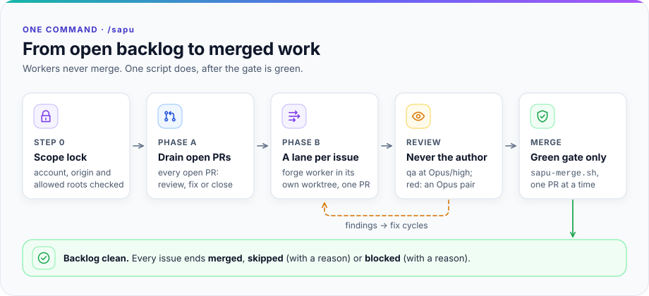

<p align="center">
  <picture>
    <source media="(prefers-color-scheme: dark)" srcset="docs/img/hero-dark.svg">
    
  </picture>
</p>

<h3 align="center">Sweep your GitHub backlog clean.</h3>

<p align="center">
  A Claude Code plugin that turns open PRs and issues into tested, reviewed, merged work,<br>
  driven by a per-repo contract.
</p>

<p align="center">
  <a href="LICENSE"></a>
  
  
  <a href="plugins/senior-dev-team/README.md"></a>
</p>

<p align="center">
  <a href="#quick-start"><b>Quick start</b></a> &nbsp;·&nbsp;
  <a href="#how-it-works-in-30-seconds">How it works</a> &nbsp;·&nbsp;
  <a href="#the-skills">Skills</a> &nbsp;·&nbsp;
  <a href="#senior-dev-team">senior-dev-team</a> &nbsp;·&nbsp;
  <a href="#safety-model">Safety</a> &nbsp;·&nbsp;
  <a href="docs/usage.md">Docs</a>
</p>

<br>

<p align="center">
  <picture>
    <source media="(prefers-color-scheme: dark)" srcset="docs/img/overview-dark.svg">
    
  </picture>
</p>

## Why sapu

<table>
  <tr>
    <td width="33%" valign="top">
      <br>
      <b>It finishes the job.</b><br>
      Every open PR is reviewed, fixed or closed. Every issue ends <i>merged</i>, <i>skipped</i> or <i>blocked</i>, each with a reason.
    </td>
    <td width="33%" valign="top">
      <br>
      <b>A second pair of eyes, always.</b><br>
      The agent that writes a PR is never the one that reviews it.
    </td>
    <td width="33%" valign="top">
      <br>
      <b>Green or it does not ship.</b><br>
      Workers never merge. One merge script does, after the gate passes.
    </td>
  </tr>
</table>

## How it works in 30 seconds

<picture>
  <source media="(prefers-color-scheme: dark)" srcset="docs/img/flow-dark.svg">
  
</picture>

## What you get

<table>
  <tr>
    <td width="33%" valign="top">

#### 🧹 One command, clean backlog.

`/sapu` drains every open PR, then works every issue in parallel lanes, one Workflow call per issue, as many at once as the machine carries.

</td>
    <td width="33%" valign="top">

#### 🔍 Independent review.

Every PR is reviewed by an agent that is not its author: the `qa` specialist (by default `senior-dev-team:senior-qa-reviewer`) at Opus/high on every tier, an adversarial Opus pair on 🔴 (a Phase A PR that only changes tests is reviewed by the orchestrator itself).

</td>
    <td width="33%" valign="top">

#### 🚦 Merge only on green.

Workers never merge; one merge script does, after the gate passes, and logs every gate run so a flaky test is proven, never assumed.

</td>
  </tr>
  <tr>
    <td width="33%" valign="top">

#### 📜 Zero repo knowledge in the plugin.

Each repo brings its own contract: account, gate commands, protected data.

</td>
    <td width="33%" valign="top">

#### 🛡️ Safe by default.

Guard hook on subagents' shell, file and MCP tools, scope lock per machine, trusted-author checks for public repos.

</td>
    <td width="33%" valign="top">

#### 🧽 Tidies up only what is proven done.

Per the repo's policy (end of the sweep, every session, or never), sapu deletes only its own branches that are proven merged, with their clean worktrees, and keeps each deleted tip under `refs/sapu-trash/`.

</td>
  </tr>
</table>

## Quick start

**1 · Add the marketplace**

```bash
claude plugin marketplace add sandalkuilang/sapu
```

**2 · Install sapu in the repo that opts in**

```bash
claude plugin install sapu@sapu --scope project
```

A new install also installs its dependency [senior-dev-team](#senior-dev-team) at the same scope. Upgrading from a version before 2.6.0? `update` does not add new dependencies: run `claude plugin install senior-dev-team@sapu --scope user` once. From a version before 2.9.0, read [what changes](docs/usage.md#upgrading-from-a-version-before-290) first.

**3 · Start a new session in that repo, then**

```
/sapu:init     # scans the repo, writes a draft contract; review it and merge it through a PR
/sapu          # sweep the backlog
```

> [!NOTE]
> Needs a GitHub remote, real tests to use as the merge gate, and a `CLAUDE.md`. Full steps: [Install and use](docs/usage.md).

## The skills

| Skill | Job |
|---|---|
| `/sapu:sapu` | **Orchestrator.** Drains every open PR, then works every issue in parallel lanes until the backlog is clean. |
| `/sapu:forge` | One issue → one tested, reviewed PR, merged through the merge script when its risk tier allows. |
| `/sapu:argus` | Autonomous QA against the local dev app. |
| `/sapu:journey` | Walks your app's business journeys through the real UI as every role, on an isolated instance of its own; files only what a script reproduced twice. |
| `/sapu:momus` | Release-readiness audit. |
| `/sapu:nemesis` | Red team against the local dev app (explicitly authorized targets only). |
| `/sapu:inspector` | Runs momus → argus → nemesis in sequence, each on its own model and effort, with one combined summary. |
| `/sapu:dream` | Forward-looking research: current engineering practice and rising repos, then falsifiable hypotheses and near-term experiments for this project; read-only. |
| `/sapu:init` | Sets up the repo contract so that the skills above can run. |

Short aliases (`/sapu`, `/forge`, …) are created by `/sapu:init`. A picture tour of every skill: [How the agents work](docs/agents.md).

## senior-dev-team

[senior-dev-team](plugins/senior-dev-team/README.md) is a second plugin in this marketplace: eight senior specialist agents (product manager, architect, full-stack developer, database engineer, UI/UX designer, QA analyst and QA reviewer, technical writer). sapu depends on it, so installing sapu installs it too.

<picture>
  <source media="(prefers-color-scheme: dark)" srcset="docs/img/senior-dev-team-dark.svg">
  
</picture>

sapu calls its specialists by role and uses these agents by default; a repo can map any role to its own agent ([Specialist agents](docs/usage.md#specialist-agents)).

| Role | Default agent |
|---|---|
| `qa` | `senior-dev-team:senior-qa-reviewer` |
| `architect` | `senior-dev-team:senior-software-architect` |
| `db` | `senior-dev-team:senior-fullstack-database-engineer` |
| `developer` | `senior-dev-team:senior-fullstack-developer` |
| `ux` | `senior-dev-team:senior-ui-ux-designer` |
| `writer` | `senior-dev-team:senior-technical-writer` |
| `product` | `senior-dev-team:product-manager` |

To use the team in every project, without sapu, install it on its own at user scope (the default):

```bash
claude plugin marketplace add sandalkuilang/sapu
```

```bash
claude plugin install senior-dev-team@sapu
```

## How it works

The plugin is an **engine**: skills, the worker agents, a guard hook and a merge script; its reviewers come from senior-dev-team. It keeps no knowledge of any particular repo. Every repo fact lives in that repo's **contract** (`.claude/sapu.json` + `.claude/sapu/*.md`, or a local copy outside the repo), in the format of [`plugins/sapu/CONTRACT.md`](plugins/sapu/CONTRACT.md).

<picture>
  <source media="(prefers-color-scheme: dark)" srcset="docs/img/sapu-dark.svg">
  
</picture>

## Safety model

| Layer | What it enforces |
|---|---|
| **Merge script** | `sapu-merge.sh` is the only way sapu merges: only a PR that `sapu-contract.mjs pr-trust` passes, only after a green gate, pinned to the gated commit. |
| **Guard hook** | Checks every subagent's shell, file, search and MCP tool calls: no direct push to the main branch, no merge, no touching the dev database or `.env` files, no writing into the main checkout or into the plugins they run under. |
| **Scope lock** | `sapu-contract.mjs check` refuses to run in a checkout outside the roots the machine config allows, with the wrong account, or with a moved `HOME`; a second `/sapu` session on the same repo stops at its Step 0. |
| **Trust checks** | In public repos, sapu works only issues and PRs from trusted authors (or accepted by a trusted account). |
| **Journey lane** | Runs on an instance of its own (worktree, ports, data and HOME), never on your servers. Its explorer agent runs nothing but the lane's browser wrapper and reads page text only as fenced data. A finding is filed only after a script reproduced it twice and `scrub` found no secret the run saw in it. |

> [!IMPORTANT]
> The guard hook reads commands, not intent: built to stop honest mistakes, it is not a sandbox. It guards **subagents only**: a skill you start yourself runs at the top level, unguarded, with your gh token. Details: [Safety and trust](docs/security.md) and [what is enforced, and by what](docs/usage.md#day-to-day).

## Docs

| | |
|---|---|
| [Install and use](docs/usage.md) | Setup, day-to-day commands, requirements and limits, cleanup, updating, rolling back, a new machine, common problems |
| [Safety and trust](docs/security.md) | Where sapu may run, machine config, public repositories, the journey lane |
| [How the agents work](docs/agents.md) | One diagram per skill |
| [Contributing](docs/contributing.md) | Repo layout, the gate, rule guard, versioning |
| [Contract format](plugins/sapu/CONTRACT.md) | What a repo's contract holds |

## License

MIT. See [LICENSE](LICENSE).
