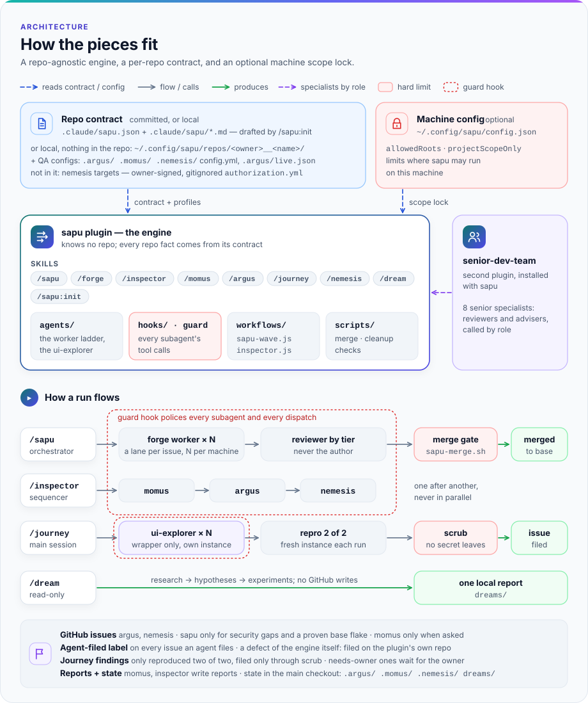
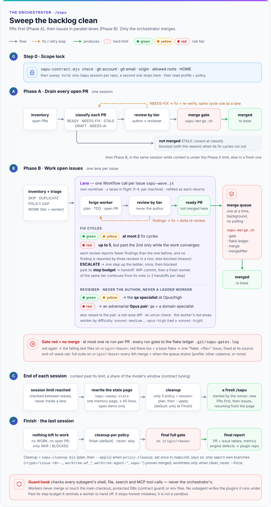
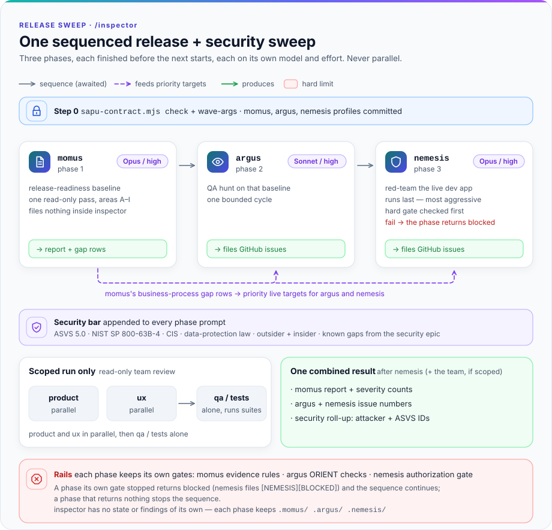
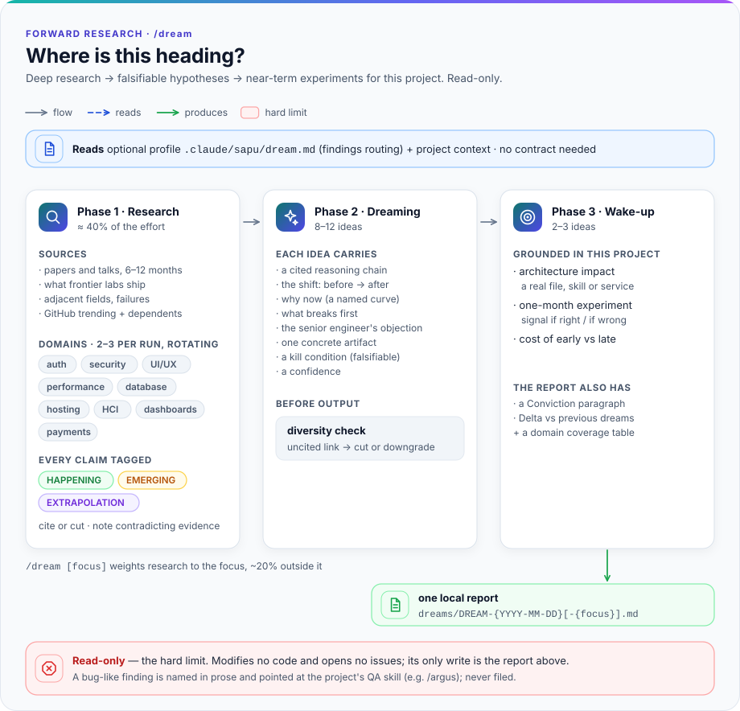
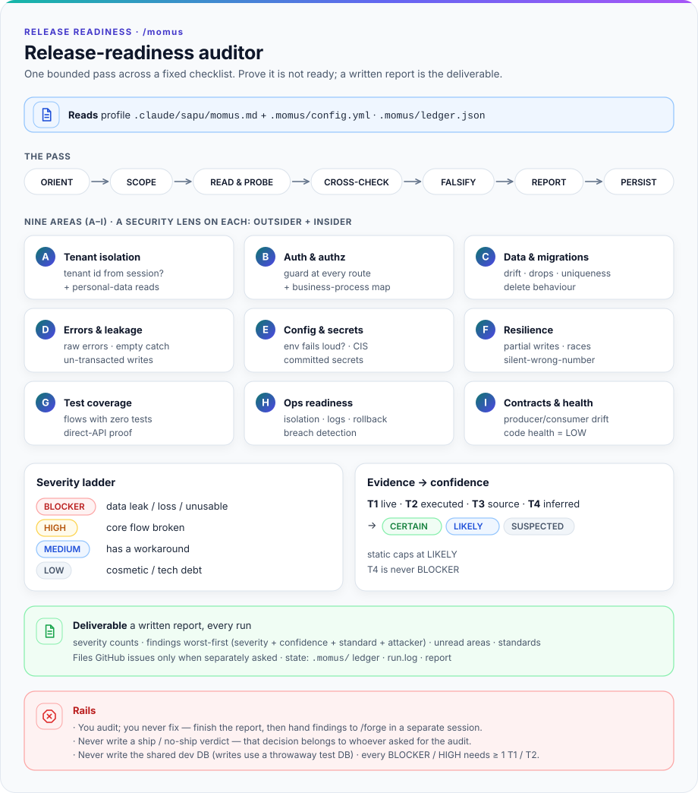

# sapu — a Claude Code plugin: autonomous backlog sweeps with a per-repo contract

One package with eight skills:

| Skill | Job |
|---|---|
| `/sapu:sapu` | Orchestrator: drains every open PR, then works every issue in parallel waves until the backlog is clean. |
| `/sapu:forge` | One issue → one tested PR. |
| `/sapu:argus` | Autonomous QA against the local dev app. |
| `/sapu:momus` | Release-readiness audit. |
| `/sapu:nemesis` | Red team against the local dev app (explicitly authorized targets only). |
| `/sapu:inspector` | Runs momus → argus → nemesis in sequence, each on its own model and effort, with one combined summary. |
| `/sapu:dream` | Forward-looking research: current software engineering practice and rising GitHub repos, then falsifiable hypotheses about where they are heading, grounded in near-term experiments for this project; read-only. |
| `/sapu:init` | Sets up the repo contract so that the skills above can run. |

The plugin is an **engine**: it keeps no knowledge of any particular repo. Every repo fact lives in that repo's **contract** (`.claude/sapu.json` + `.claude/sapu/*.md`), in the format of [`plugins/sapu/CONTRACT.md`](plugins/sapu/CONTRACT.md).

## Where sapu may run

Three layers, none of which assumes who the owner is:

1. **Project scope.** Install the plugin with `--scope project`, so that only a repo that commits its `enabledPlugins` loads it: a repo opts in explicitly. At user scope, the plugin — including its guard hook for subagents — is active in every repo on that machine; `projectScopeOnly: true` in the machine config makes sapu refuse to run in that state.
2. **Identity from the contract.** The repo contract names its account (`ghUser`, `gitEmail`, `repo`). `sapu-contract.mjs check` refuses to run when the active `gh` account is not the contract's `ghUser`, when `git config --local user.email` is not the contract's `gitEmail`, or when `origin` is not the contract's `repo`.
3. **Machine limits (optional).** A per-machine config belonging to the person who uses that machine may restrict checkouts to certain roots and require project scope (next section). The contract cannot widen it, and `/sapu:init` refuses repos outside those roots.

## Restricting where sapu may run (optional)

It lives only at `~/.config/sapu/config.json`. `XDG_CONFIG_HOME` is deliberately ignored: env variables can be set by the `.claude/settings.json` a repo commits. This file belongs to one person on one machine and is never committed to any repo. sapu never reads it from a repo, so a repo contract cannot loosen it; a config that turns out to live inside the repo's own checkout is refused.

```json
{
  "allowedRoots": ["~/projects"],
  "projectScopeOnly": true
}
```

| Key | Meaning |
|---|---|
| `allowedRoots` | A list of directories, absolute or `~/…`. The main checkout must be **inside** one of them: symlinks are resolved on both sides, and the root itself does not count. |
| `projectScopeOnly` | `true` = refuse to run when the plugin is installed at user scope, or when its install scope cannot be determined. |

Both keys are optional. Without the file, there is no root limit and no user-scope refusal; only the identity from the contract is checked. An unknown key, a wrong type, or an empty `allowedRoots` is an error: sapu stops with its message, so that a typo never silently lifts a restriction. So is a file that exists but cannot be read, and a symlink on its path that does not end in a file (write `{}` when you really want no restriction).

Example: when one machine holds repos that may be swept and repos that may not, put the ones that may under one folder (e.g. `~/projects`) and write the config above. sapu then refuses to run outside that folder, whatever the repo contract says.

## Install

Add the marketplace, from GitHub:

```bash
claude plugin marketplace add sandalkuilang/sapu
```

or from a local clone:

```bash
claude plugin marketplace add <path-to-clone>
```

When installed, the plugin is **copied** into Claude Code's cache (`~/.claude/plugins/cache/<marketplace>/<plugin>/<version>`), also when the marketplace is a local folder. Edits in the clone reach the repos that use it only after the version is raised and the plugin is updated (see "Updating the plugin"). To try edits without installing, run `claude --plugin-dir <path-to-clone>/plugins/sapu`, which loads that folder directly.

Then, from the main checkout of the repo that opts in:

```bash
claude plugin install sapu@sapu --scope project
```

When the marketplace repo is private, cloning it uses your existing git credentials (`gh auth git-credential`), so the active `gh` account must have access to that repo.

Once installed, run `/sapu:init` in a new session to write a draft contract. Review that draft, then commit it together with `.claude/settings.json`.

The draft also holds project-level aliases `.claude/skills/<name>/SKILL.md` (never in `~/.claude/skills`), so typing `/sapu`, `/forge`, … is enough instead of `/sapu:sapu`, `/sapu:forge`, ….

## Usage

### Once per repo

1. Install the plugin at project scope (see above), then **start a new session**. A plugin loads when a session starts.
2. Type `/sapu:init`. It scans the repo and writes a draft contract: `.claude/sapu.json` and the profiles `.claude/sapu/*.md`. It also creates the short aliases `/sapu`, `/forge`, and so on. Every question it asks is one you really have to decide: the account, the gate commands, the protected databases, and the nemesis targets.
3. Review the draft, then merge it through a PR. From then on the skills below can be used.

Each profile's `##` section headings are English and match exactly what `sapu-contract.mjs profiles --list` prints for that skill.

Repo requirements:
- a GitHub remote, with the account its contract names (`ghUser`, `gitEmail`, `repo`);
- real tests that can run as the merge gate;
- a `CLAUDE.md`.

A repo without tests can only use `/dream`.

### Day to day

| To do what | Type | What happens |
|---|---|---|
| Clean up every open PR and issue | `/sapu` | **Phase A:** every open PR is reviewed, fixed, or closed. **Phase B:** issues are worked in waves (at most 4 issues per wave). Every PR is reviewed by an agent that is not its author, and a merge happens only after a green gate. Every issue ends *merged*, *skipped* (with a reason), or *blocked* (with a reason). |
| Work one issue through to a PR | `/forge 123` | Creates a branch, implements + tests, then opens a PR. This skill never merges on its own. |
| Hunt bugs, fraud gaps and UI defects in the running dev app | `/argus` | Needs the dev app running and `.argus/config.yml`. Findings are filed as deduplicated issues. |
| Release-readiness audit | `/momus` | Produces a report per area. Issues are filed only when you ask for it. |
| Try to break into the dev app (red team) | `/nemesis` | Attacks only the targets in a `.nemesis/authorization.yml` you signed yourself, and only dev hosts (localhost). |
| Full audit before release: momus → argus → nemesis | `/inspector` | Runs the three in sequence (never at the same time), each with its own model and effort, then one combined summary plus a security roll-up. `/inspector payments` narrows all three to one area and adds a read-only team review. The prerequisites of `/momus`, `/argus`, and `/nemesis` apply. |
| Research where technology is heading (auth, security, UI/UX, databases, payments, …) and experiment ideas for this project | `/dream` | One local report in `dreams/` holding sourced findings, hypotheses with kill conditions, and a month of experiments; changes no code and writes nothing to GitHub. |

Without the aliases, the full names are `/sapu:sapu`, `/sapu:forge`, and so on. Plain chat ("run sapu", "work issue 123 with forge") also triggers the matching skill.

`/sapu` tips:
- Run it in a **new session**, and only one sapu session per repo at a time.
- To skip certain PRs: `/sapu skip PR #<number>`.
- A session stops by itself when its context passes about 250k tokens. Its summary is written to project memory, then you are asked to start a new session with `/sapu`, which continues from that summary.
- The final report holds the PR and issue tables, the decisions taken with their sources, and the token metrics per session.

What is enforced, and by what:
- **The merge script** (`sapu-merge.sh`, the only way sapu merges) gates or merges only a PR that `sapu-contract.mjs pr-trust` passes (see "Public repositories"), only after a green gate, pinned to the gated commit.
- **The guard hook** refuses a worker or reviewer agent's direct push or force-push to the main branch, a merge, the common ways to bring a PR's or a fork's code into a worktree (`gh pr checkout`, fetching PR refs, applying a PR's diff, cloning), any change to the acceptance label, touching the dev database or `.env` files, and writing into the main checkout — the exact list, and what it does not trace, is in [`CONTRACT.md`](plugins/sapu/CONTRACT.md) §Engine floor. It reads commands, not intent: built for honest mistakes, it is not a sandbox against an agent set on getting around it. And it guards **subagents only**: a skill you start yourself (`/sapu`, `/forge`, `/argus`, `/momus`, `/nemesis`) runs at the top level, unguarded, with your gh token — there only the skills' own rules hold.
- **The scope lock** (`sapu-contract.mjs check`) refuses to run in a checkout outside the roots the machine config allows, or with the wrong account.
- Everything else in the skills — what to read, what counts as instructions — is a rule for the agents, not a lock.

### Specialist agents

Reviewers and advisers (the 🔴 review pair, forge's QA, the `/inspector` team review) are called by role: `qa`, `architect`, `db`, `developer`, `ux`, `writer`, `product`. The plugin ships built-in agents for all seven (`sapu:sapu-qa`, `sapu:sapu-architect`, …), so sapu runs on any machine without extra agents. A repo that has stronger agents of its own can map roles to them through the optional `specialists` field of `.claude/sapu.json`, e.g. `"specialists": {"qa": "my-qa-agent"}`; roles it does not name keep the built-in. The format is in [`CONTRACT.md`](plugins/sapu/CONTRACT.md) §Specialist agents.

### Public repositories

In a public repo anyone can open a PR or an issue and comment on both, and sapu works without asking. So only the **trusted set** steers it: the account that runs sapu (the contract's `ghUser`) plus the optional `trustedAuthors` in `.claude/sapu.json`, each written with its numeric GitHub id — `{"login": "alice", "id": 2}`, the id from `gh api users/alice --jq .id`. The id is what is compared everywhere, because a login can be renamed and re-registered by someone else; `sapu-contract.mjs check` stops when a recorded login no longer belongs to its id.

What an outsider (an account outside that set) **cannot** make sapu do:
- **Run their code on your machine.** A PR from a fork, opened by an outsider, or carrying an outsider's commit is never checked out, never gated (the gate runs the PR's tests) and never merged: `sapu-merge.sh` refuses it before it touches anything, agents cannot check it out or apply its diff, and the sweep lists it (number and author only) in its final report for you. So is a PR that closes or refs an issue sapu may not work.
- **Put their issue into a wave.** sapu skips it until a trusted account applies the acceptance label (`sapu:accepted`, or the contract's `labels.accepted`) — and applying it is yours to do: no agent may touch that label. Any edit or new title by an outsider after that undoes the acceptance (so does renaming or editing the label), and an agent reads the issue only from the same snapshot the check judged.
- **Steer an agent through a comment,** or hide a finding behind a decoy issue: comments are read only through `sapu-contract.mjs issue-trust <N> --comments`, which drops everyone else's, and an outsider's issue never counts as a duplicate.

What an outsider still **can** do: open PRs and issues sapu will not act on, and put text in the body of an issue you accepted. Agents treat all of it as data, never as instructions, but that is a rule for a model, not a sandbox: read an outsider's issue — and the last edit its verdict shows — before you apply the label.

Three things to decide yourself:
- **Who may accept.** Every agent works under the account that runs sapu, so a label that account applies could be an agent's — and top-level skills are not guarded. Set `labels.acceptors` to the human account(s) that accept (`{"login", "id"}`, like `trustedAuthors`) and leave the account sapu runs under out of it. If sapu runs under your own gh account, that separation is only possible by accepting from another account (or running sapu under its own bot account); otherwise acceptance rests on the skills' rule that no agent touches the label.
- **Signed commits.** Your `gitEmail` is public in the contract, and GitHub credits a commit to whichever account owns its email — so without signatures the commit check is only attribution. If you ever push an outsider's branch into your repo (to finish or adopt it), set `"requireSignedCommits": true` and sign your commits: then every PR commit must carry a signature GitHub verifies, by a trusted account. Commits GitHub signs itself (the web UI's "Update branch", accepted suggestions) are refused then; never trust the `web-flow` account to get them through.
- **Bots.** Trusting an app (`github-actions[bot]`, a dependency bot, a coding agent) trusts whoever can make it act — list one in `trustedAuthors` only when only trusted people can.

Also protect the repo on GitHub itself: branch protection on the base branch (PRs required, no direct or force pushes), and approval before Actions workflows run on outside contributors' PRs. The full rules and their limits are in [`CONTRACT.md`](plugins/sapu/CONTRACT.md) §Trusted authors.

### Updating the plugin

Auto-update is off, so a new version only arrives when you pull it yourself:

```bash
claude plugin marketplace update sapu
```

```bash
claude plugin update sapu@sapu --scope project
```

Then start a new session. Both commands also work for a marketplace from a local folder: the first re-reads that folder, and the second copies its new version into the cache. When the version did not go up, nothing is copied. To check that the installed copy matches its source:

```bash
claude plugin list --json
```

Take the `installPath` of the `sapu@sapu` entry, then compare that folder with `plugins/sapu` in the clone using `diff -rq`.

### Common problems

| Message | What it means |
|---|---|
| `…/.claude/sapu.json not found … (run /sapu:init)` | This repo has no contract yet. Run `/sapu:init`. |
| `refusing to run here: … is outside the allowed roots in …/sapu/config.json` | This checkout is outside your machine config's `allowedRoots`, and is refused on purpose. Move the checkout, or change the machine config; a repo contract cannot change it. |
| `machine config … is invalid` | The machine config is malformed (an unknown key, a wrong type, or an empty `allowedRoots`). Fix it per the section "Restricting where sapu may run". |
| `… installed at USER scope …` / `cannot confirm the plugin's install scope` | The machine config sets `projectScopeOnly`, and the plugin is installed at user scope (or `claude plugin list --json` failed / shows no project-scope install). Uninstall it (`claude plugin uninstall sapu@sapu --scope user`), then install it with `--scope project` in the repo that opts in. |
| `active gh account is "…", the contract needs "…"` | The active `gh` account is wrong. Switch it yourself with `gh auth switch --user <the contract's ghUser>`, then try again. |
| A wave stops with a "canary" reason | The guard hook is not active. Make sure `claude plugin list` shows `sapu@sapu` enabled at project scope, then start a new session. |
| `refusing untrusted PR #… (rule: …)` | `pr-trust` refused it: a fork, an author or commit author outside the trusted set, an unsigned commit (with `requireSignedCommits`), or an issue it closes or refs that fails `issue-trust`. sapu never gates or merges it: review it yourself, or, when its author should be trusted, add `{"login", "id"}` to `trustedAuthors`. |
| `issue #… untrusted: …` | The issue's author is outside the trusted set, and no trusted account applied the acceptance label (or it was removed, or an outsider edited the text since). Read it; to let sapu work it, apply `sapu:accepted` (or the contract's `labels.accepted`). |
| `trustedAuthors: "…" now resolves to …` | A trusted login was renamed, deleted, or taken by another account. Find out who that account is now, then fix or remove the entry. |
| A merge exits with code 3 | The PR is already merged, but the repo's own cleanup (`mergeAfter`) failed. Read its message and fix it before the next merge. |
| A merge exits with code 75 / "gate setup failed" | The infrastructure is not ready (for example, the DB container is down). This is not a PR defect: get the infrastructure ready, then try again. |

## How the agents work

<sub>A picture tour of each skill. What to type is in the <a href="#day-to-day">usage table</a> above.</sub>

The plugin is the **engine** — skills, agents, a guard hook and a merge script — and it knows nothing about any one repo. Each repo brings a committed **contract** (`.claude/sapu.json` + `.claude/sapu/*.md` profiles, written by `/sapu:init`); an optional per-machine config decides where sapu may run.



### /sapu — sweep the backlog

Drains open PRs first (Phase A), then works open issues in parallel waves (Phase B). Each wave runs a **forge** worker per issue in its own worktree; every PR gets independent review chosen by risk tier (🟢/🟡/🔴; a pair for 🔴), with up to two fix cycles. Workers never merge — only the orchestrator does, through the merge gate.



### /inspector — full sweep before release

Runs momus, then argus, then nemesis — one phase finished before the next starts, each on its own model and effort. momus's business-process gap rows become priority targets for the other two; a scoped run adds a read-only team review. One combined summary and a security roll-up at the end.



### /dream — where is this heading

Read-only research: researches 2–3 of nine technology domains per run (stalest first, or weighted to a focus with ~20% outside it), then forms 8–12 falsifiable hypotheses each with a cited reasoning chain and a kill condition, then grounds two or three into one-month experiments for this project. It modifies no code and opens no issues; its only write is the report.



### /argus — autonomous QA

One bounded cycle of eleven phases (ORIENT → ROTATE), applying five review lenses and six bypass classes. Every claim is graded by evidence tier and falsified before it becomes a de-duplicated GitHub issue. Tests, never fixes; the dev app and seeded accounts only.


### /momus — release-readiness audit

One pass across nine areas (A–I), each read with a security lens for outsiders and insiders and graded by a four-level severity ladder. The deliverable is a written report; it files issues only when asked and never writes a ship/no-ship verdict.



### /nemesis — authorized red-team

Attacks the local dev app only. A hard gate — signed, unexpired authorization; allowlisted targets resolving to loopback (or an owner-attested private dev address); dev environments only; no STOP file — must pass before any active testing, and a kill switch halts the run mid-cycle. Then passes 0–7 from residue intake and recon through business logic to detection-integrity, plus six bypass classes every cycle. Files security issues; non-destructive, seeded low-privilege accounts only.


## What is in this repo

```
.claude-plugin/marketplace.json   marketplace "sapu" → plugins/sapu
.claude/sapu.json                 this repo's own sapu contract (its maintainer's identity)
plugins/sapu/
  .claude-plugin/plugin.json
  CONTRACT.md                     the repo contract format
  skills/                         sapu, forge, argus, momus, nemesis, inspector, dream, init
  agents/                         the worker ladder sapu-sonnet-low … sapu-opus-high, and the built-in specialists sapu-qa … sapu-product
  hooks/hooks.json                PreToolUse guard (Bash + Read/Write/Edit), active for every subagent, not for the orchestrator
  workflows/sapu-wave.js          one Phase B wave as code
  workflows/inspector.js          the momus → argus → nemesis sequence as code
  scripts/                        sapu-contract.mjs, sapu-guard.mjs, sapu-merge.sh, sapu-metrics.ts
scripts/rule-guard.ts             gate: a weakened engine rule needs a Rule-Change trailer (not shipped)
tests/                            vitest: guard, workflows, contract, metrics, rule-guard, and "the engine is clean of repos"
```

The plugin has no npm dependencies. Its scripts run on Node ≥ 22.18 (`.ts` runs directly), `bash`, `git`, `gh`, and `jq`.

## Changing the plugin

Every change goes through a PR, with a green gate and a review by an agent that is not its author.

```bash
npm install
```

```bash
npm run gate
```

`npm run gate` validates the manifests (`claude plugin validate`) and then runs every test. One test (`tests/engine.test.ts`) fails when a file in this repo points at one machine, one account, or one consuming repo: an issue number, a date (outside a URL), a macOS or Linux home directory path, a laptop folder name, or one person's split of repos. A consuming repo's facts belong in that repo's contract. The same file also fails when the plugin, this README or `docs/` carry prose in another language than English.

The names of your own consuming repos must not be written into a test, because writing them down is exactly what leaks them. Put them in `.sapu-banned` at the root of this clone: one JS regex per line (case-insensitive), `#` for comments. That file is gitignored and read by the same test; a worktree without the file reads the main checkout's.

`.claude/sapu.json` is the sapu contract of **this** repo, like CODEOWNERS: it names its maintainer's identity (`repo`, `ghUser`, `gitEmail`). A fork replaces it with its own identity. That, together with `repository`/`author` in `plugin.json`, `owner` in `marketplace.json`, and this repo's own `owner/name` slug where this README says how to install or clone it, is the only place an identity may appear; the same test exempts exactly those JSON fields, no more.

Before the tests, the gate runs `node scripts/rule-guard.ts`. It compares the branch with `origin/main` (or `GATE_DIFF_BASE`) and goes red when:

- a normative clause (must, never, only, should, do not, …, and their Indonesian equivalents) in `README.md`, `plugins/sapu/CONTRACT.md`, `plugins/sapu/skills/**`, or `plugins/sapu/agents/**` is lost or changed;
- an agent's `tools:`, `model:`, or `effort:` changed, or its agent file was deleted;
- one of the files that enforce the rules changed at all or was deleted — tightening changes included:
  - `plugins/sapu/hooks/hooks.json`
  - `plugins/sapu/scripts/sapu-guard.mjs`, `sapu-merge.sh`, `sapu-contract.mjs`
  - `plugins/sapu/workflows/sapu-wave.js`
  - `tests/engine.test.ts` (here a context budget that went up or vanished is also named on its own)
  - `scripts/rule-guard.ts` and `tests/rule-guard.test.ts`
- `gate` in `package.json` no longer runs `node scripts/rule-guard.ts` as an `&&` step of its own, or contains anywhere `||`, `;`, a lone `&`, a newline, or `exit`, which could make the gate pass while the guard is red (for example `… && vitest run || true`).

Adding rules, moving clauses, or re-wrapping lines does not trigger it. When such a change is intended, write the reason as a trailer in one of the branch's commits:

```
Rule-Change: <reason, at least 20 characters>
```

Every PR that changes the content of `plugins/sapu/` must raise `version` in `plugins/sapu/.claude-plugin/plugin.json` in that same PR: patch for fixes, minor for new behaviour. Claude Code's cache is keyed by version, so without a version bump consuming repos keep using the old copy. `tests/engine.test.ts` refuses a change without a version bump. After the merge, run both commands of "Updating the plugin" in the consuming repos. Auto-update is off for third-party marketplaces, so a version never changes silently.

## License

MIT. See [LICENSE](LICENSE).
