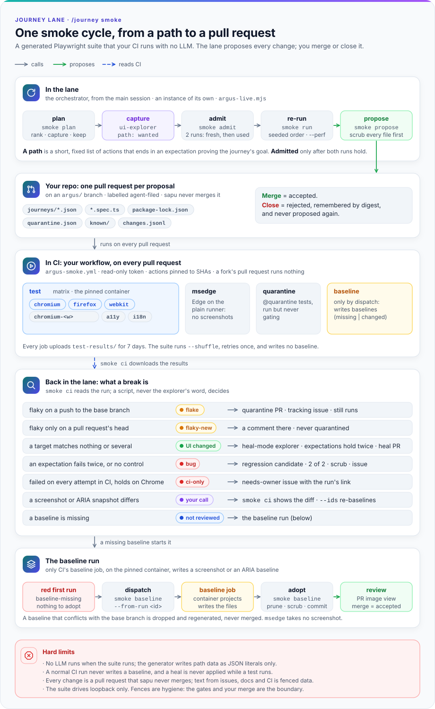
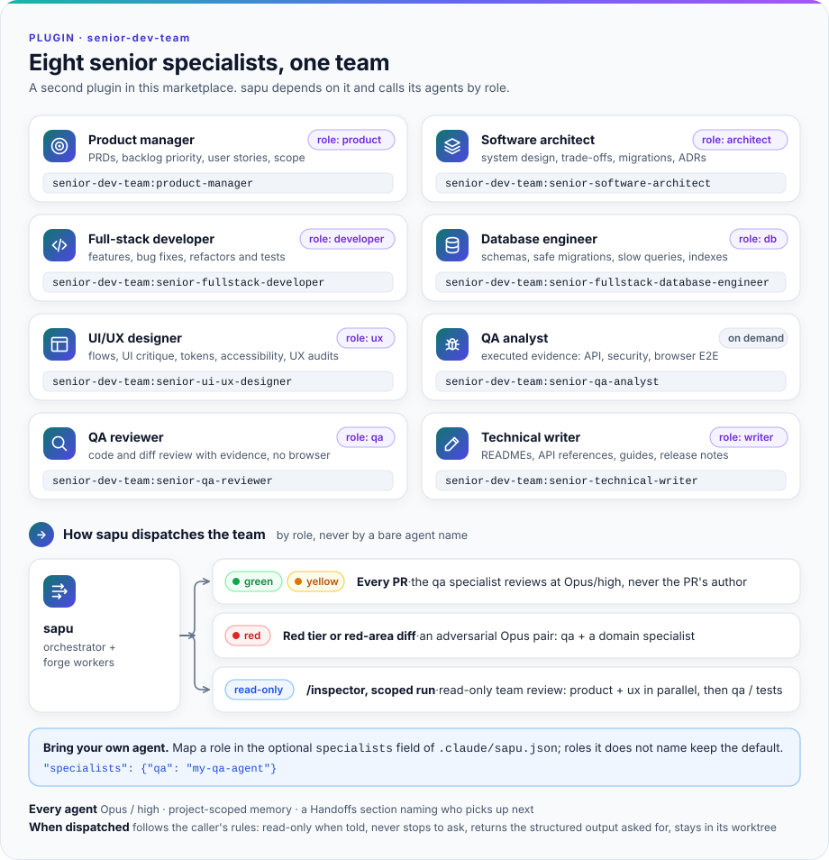

# Install and use

<sub><a href="../README.md">README</a> · <b>Install and use</b> · <a href="agents.md">How the agents work</a> · <a href="security.md">Safety and trust</a> · <a href="contributing.md">Contributing</a></sub>

## Install

Add the marketplace, from GitHub:

```bash
claude plugin marketplace add sandalkuilang/sapu
```

or from a local clone:

```bash
claude plugin marketplace add <path-to-clone>
```

When installed, the plugin is **copied** into Claude Code's cache (`~/.claude/plugins/cache/<marketplace>/<plugin>/<version>`), also when the marketplace is a local folder. Edits in the clone reach the repos that use it only after the version is raised and the plugin is updated (see "Updating the plugin"). To try edits without installing, run `claude --plugin-dir <path-to-clone>/plugins/sapu`, which loads that folder directly.

Then, from the main checkout of the repo that opts in:

```bash
claude plugin install sapu@sapu --scope project
```

sapu depends on the [senior-dev-team](../plugins/senior-dev-team/README.md) plugin from the same marketplace, so this command installs and enables it too, at the same scope. Its agents are sapu's default specialists ("Specialist agents", below).

When the marketplace repo is private, cloning it uses your existing git credentials (`gh auth git-credential`), so the active `gh` account must have access to that repo.

Once installed, run `/sapu:init` in a new session to write a draft contract. Review that draft, then commit it together with `.claude/settings.json` (a local contract, below, is not committed). It also writes `.claude/settings.local.json` for this machine, never committed: the main session returns to the project directory after every command, and new worktrees link `<MAIN>`'s agent memory when that directory is untracked and can be ignored as a link.

The draft also holds project-level aliases `.claude/skills/<name>/SKILL.md` (never in `~/.claude/skills`), so typing `/sapu`, `/forge`, … is enough instead of `/sapu:sapu`, `/sapu:forge`, ….

## Usage

### Once per repo

1. Install the plugin at project scope (see above), then **start a new session**. A plugin loads when a session starts.
2. Type `/sapu:init`. It scans the repo and writes a draft contract: `.claude/sapu.json` and the profiles `.claude/sapu/*.md`. It also creates the short aliases `/sapu`, `/forge`, and so on. Every question it asks is one you really have to decide: the account, the gate commands, the protected databases, the security epic, the merge method (only when the repo does not allow squash merges), the end-of-wave net and the teardown command (see "How a merge works", below), and the repo's **policy** (next list). It proposes creating the labels the contract names (the acceptance, needs-owner and agent-filed labels too) and creates them only when you agree. It never fills in nemesis targets: you sign those yourself in `.nemesis/authorization.yml`.
3. Review the draft, then merge it through a PR. From then on the skills below can be used. A local contract needs no PR: it works as soon as init has verified it.

The policy is asked in popups, one choice per field; the full table is in [`CONTRACT.md`](../plugins/sapu/CONTRACT.md) §Policy:
- **Where the contract lives:** committed in the repo, or local in `~/.config/sapu/repos/<owner>__<name>/` so that nothing about sapu enters the repo (for a repo that is not yours).
- **Who merges:** sapu after a green gate, or people (`sapu-merge.sh` runs the gate, requests your reviewers and hands the PR over).
- **Which issues:** every trusted issue, only issues assigned to you, or only issues with one label.
- **Traces on GitHub:** visible, or none (no sapu labels, comments or wording on GitHub; review records stay in `.git/`).
- **Filing issues, which skills may run, and an optional pre-PR command** that must report zero findings at the severities the owner picks before a PR is handed in.
- **Cleanup** of sapu's merged branches and worktrees: at the end of the sweep (the default), also at the end of every session, or never (see "Cleaning up branches").

Each profile's `##` section headings are English and match exactly what `sapu-contract.mjs profiles --list` prints for that skill.

When you enable `journey` among the skills (with `argus`, which it runs under: `/journey` checks both, and init selects `argus` with it), init also drafts `.argus/live.json`, the instance the journey lane builds for itself (its format is [`skills/journey/live.md`](../plugins/sapu/skills/journey/live.md)):
- **From the scan, each fact confirmed by you:** a `services` entry for every local service the repo's config names (cache, queue, object store, search engine, mail server), the roles from `.argus/config.yml`'s `test_accounts`, the repo's dev and E2E ports as `reserved_ports`, and a `port_range` of its own.
- **Secrets stay out of it:** passwords and TOTP secrets are written as `${NAME}`. Init writes `.argus/live.env` with those names and empty values for you to fill (only when the file does not exist yet: it never overwrites yours), and adds its file name to the contract's `guard.envFiles`, so no agent reads it. Init never reads or writes a value.
- **Your two confirmations,** asked in these words: every outbound integration (payments, email, messaging, identity checks) runs in test or mock mode under `env`, because a browser cannot see server-side calls; and the data `reset` creates is synthetic (no real personal or business data), so screenshots and page text may appear in issues. The lane refuses to start unless both are true.
- **`store_check` and `reset` are never invented:** a repo without commands that select and reset a separate datastore gets the prerequisite reported missing, and init leaves `journey` off until the repo adds them.
- **The smoke suite is a separate opt-in.** Init asks whether you want it, and only then drafts `.argus/smoke.json`, adds its gitignore exception and offers the CI workflow ([The smoke suite](#the-smoke-suite)). Say no and nothing about it is written.
- **Verified with `node "${CLAUDE_PLUGIN_ROOT}/scripts/argus-live.mjs" check`**, which runs the lane's checks of the file (its schema, every unset `${NAME}`, the base URLs resolving to loopback only, the `services`, a protected `store`, a literal password or TOTP secret, an env file git tracks or does not ignore) and of the contract's `guard.envFiles` without starting anything, and prints `live: ok — <r> roles, <a> accounts, <s> start entries`, or one `refused: …` line per fault. It reads the draft contract; `up` reads the committed one, so check adds a `note:` line until the contract that covers `env_file` is committed, and `up` refuses until then. A `${NAME}` you have not filled yet is reported as yours to fill, not as a failure of init.

Repo requirements:
- a GitHub remote, with the account its contract names (`ghUser`, `gitEmail`, `repo`);
- real tests that can run as the merge gate;
- a `CLAUDE.md`.

A repo without tests can only use `/dream`.

### Day to day

| To do what | Type | What happens |
|---|---|---|
| Clean up every open PR and issue | `/sapu` | **Phase A:** every open PR is reviewed, fixed, or closed. **Phase B:** each issue is one Workflow call (a *lane*), up to `lanes` in flight, from the machine's cores, memory and current load. Every PR is reviewed by an agent that is not its author, and merged one at a time through `sapu-merge.sh`, only after a green gate. Every issue ends *merged*, *skipped* (with a reason), or *blocked* (with a reason). |
| Work one issue through to a merged PR | `/forge 123` | Creates a branch, implements + tests, opens a PR, has it reviewed by an agent that is not its author, then gates and merges it through `sapu-merge.sh` when its risk tier allows (🔴 only through the `needs-ai` protocol). Under `/sapu`, a worker stops at the open PR instead. |
| Hunt bugs, fraud gaps and UI defects in the running dev app | `/argus` | Needs the dev app running and `.argus/config.yml`. Findings are filed as deduplicated issues. Run from the main session with `.argus/live.json` in place, a cycle may pick the journey lane instead (next row). |
| Walk the app's business journeys through the real UI, as every role they need | `/journey` | One bounded cycle on an isolated instance argus starts itself (its own worktree, ports, data and HOME), never on your servers: the journey catalog refreshed from the code when it is stale, the top journeys walked by `sapu:ui-explorer` agents, every candidate reproduced two of two by a script before anything is filed. `/journey list` prints the catalog and starts no app; when the catalog is stale it first rebuilds it with one map-mode explorer (`list --rebuild` always does); `/journey <id> …` walks the journeys named. Needs `argus` and `journey` both allowed in `policy.skills`, argus's profile and `.argus/config.yml`, `.argus/live.json` from `/sapu:init`, a Chrome-family browser (Google Chrome or Microsoft Edge), macOS or Linux with `lsof` or `ss`, and Docker only when the instance uses Compose. Run it from the main session, never inside `/inspector`. |
| Leave a regression net behind: a generated Playwright suite of the critical journeys, run by your CI on every pull request | `/journey smoke` | One smoke cycle (the journey lane's `smoke` mode): the lane plans which journeys the suite should hold, captures and admits their paths, re-runs the suite's paths, reads CI's last run, heals or reports what broke, and proposes every change to the suite as a pull request on an `argus/` branch that you merge or close. No LLM runs when the suite runs. Needs everything `/journey` needs, a committed contract and `traces: "visible"`; details in "The smoke suite", below. |
| Release-readiness audit | `/momus` | Produces a report per area. Issues are filed only when you ask for it. |
| Try to break into the dev app (red team) | `/nemesis` | Attacks only the targets in a `.nemesis/authorization.yml` you signed yourself, and only dev hosts (localhost). |
| Full audit before release: momus → argus → nemesis | `/inspector` | Runs the three in sequence (never at the same time), each with its own model and effort, then one combined summary plus a security roll-up. `/inspector payments` narrows all three to one area and adds a read-only team review. The prerequisites of `/momus`, `/argus`, and `/nemesis` apply. Its argus phase never runs the journey lane: run `/journey` yourself. |
| Research where technology is heading (auth, security, UI/UX, databases, payments, …) and experiment ideas for this project | `/dream` | One local report in `dreams/` holding sourced findings, hypotheses with kill conditions, and a month of experiments; changes no code and writes nothing to GitHub. |

Without the aliases, the full names are `/sapu:sapu`, `/sapu:forge`, and so on. Plain chat ("run sapu", "work issue 123 with forge") also triggers the matching skill.

`/journey` tips:
- **One invocation is one bounded cycle**, within `limits.max_cycle_minutes`, on up to `limits.max_parallel_journeys` journeys; a pass over the whole catalog is that many invocations. The report ends with the next picks.
- **To watch,** run the `argus-live.mjs show` command the cycle prints, in a terminal of your own: it opens the browser CLI's dashboard on the cycle's sessions and blocks until Ctrl-C (closing the terminal or a `kill` ends it and its dashboard too). It starts with `cd` to your main checkout, since it reads the lock there. The cycle never runs it itself.
- **A finding only you can rule on** (a doc that contradicts coherent behaviour, a usability heuristic with no written rule) carries the needs-owner label (`labels.needsOwner`, default `argus:needs-owner`), and `/sapu` and `/forge` skip it. Remove the label to accept the finding, or close the issue as not planned to rule the behaviour intended. No agent does either: the guard refuses both to every subagent.
- **A cycle running beside a sweep** shares the machine's CPU with the sweep's gates: a gate that overlapped a cycle is logged with ` live=1` in `.git/sapu-gates.log` and never counts toward a flake proof.

`/sapu` tips:
- Run it in a **new session**, and only one sapu session per repo at a time: a second `/sapu` session on the same repo stops at Step 0 while the first holds the repo's sweep marker (see "Common problems").
- To skip certain PRs: `/sapu skip PR #<number>`.
- A defect of the engine itself (a skill's rule, the guard, a workflow, `sapu-merge.sh`, `sapu-contract.mjs`) is never patched around in your repo: no local copy of a plugin file, no profile rule that contradicts the engine. The orchestrator files it on the plugin's own repository, with no data from your repo, after checking for an open duplicate there; when the policy forbids filing (`fileIssues: false`, or `traces: "none"`) or the active account is not the contract's, it only proposes it in the final report. The final report lists each engine defect as filed, a duplicate, or unfiled. The format is in [`CONTRACT.md`](../plugins/sapu/CONTRACT.md) §Engine defects go upstream.
- A session ends between waves once its context passes its limit (by default 75% of the model's context window, 60% at the end of Phase A; `sapu-contract.mjs tuning` prints it). sapu then rewrites one project-memory page, `sapu-sweep-state` (whole, at most 40 lines, only what is still open: skipped and blocked items with their reasons, next candidates, decisions waiting for you, an unresolved red net, open base flakes), runs the branch cleanup when the policy says `session` (below), and asks you to start a new session with `/sapu`, which continues from that page.
- The sweep finishes in the session whose triage finds no work and no open PR left: a branch cleanup (unless the policy says `never`), a final full gate on the base branch, and the final report.
- The final report holds the PR and issue tables, the decisions taken with their sources, and the metrics per session: tokens and their cost in dollars at API prices (a weight for quota use on a subscription), per merged PR.

How a lane works: a forge worker from the ladder (`sapu-sonnet-medium` … `sapu-opus-high`, picked by difficulty) implements the issue in its own worktree and opens a PR. The `qa` specialist (by default `senior-dev-team:senior-qa-reviewer`) reviews it at Opus/high on every tier; a 🔴 issue, or a diff that touches a red area, gets an adversarial Opus pair instead (`qa` + a domain specialist). A worker whose own red-area check finds a red area raises the tier before review starts. Findings go to a fresh fixer of the same tier (one step up for an invariant domain) for fix cycles, each followed by a review of the new commits: at most two on 🟢/🟡; on 🔴 up to five, but past the second only while the work converges, meaning each review reports fewer findings than the one before and no finding is reported by three reviews in a row. Otherwise the issue is blocked with the reason (a NEEDS-FIX PR in Phase A follows the same rule). A judgment call the issue does not settle sends the work one step up the ladder, once. A worker past its step budget (the guard reminds it; contract `tuning`) hands off: it commits its work in progress, tears down its test resources, and a fresh worker of the same tier continues from its note (at most two handoffs per step). To follow a running lane, open its run: the card shows only the workflow's fixed description, while the run's log names the issue, its tier and worker, then every finished step with its result and the PR. The orchestrator also posts one status line per lane in the chat when it launches the lane and when the lane returns.

How a merge works: each ready PR goes through `sapu-merge.sh`, one at a time. The orchestrator runs it as a background command and waits for its notification; it never polls. The script runs the merge gate, records the run in the flake ledger, merges, and calls the repo's `mergeAfter`.
- **A red gate** names its failing test files and a verdict. A PR gets at most one re-run. When it is red again, the failing files run on a fresh checkout of the base branch: red there too means a flaky test on the base branch (a *base flake*), which gets one `flake: <test file>` issue and is fixed at its source, never by a retry or a looser assertion; green there means the PR broke it.
- **The end-of-wave net** runs the repo's full suite on the base branch after every fourth merge and when the queue drains, to catch regressions per-PR gates miss. The profile's `## End-of-wave net` can set another cadence (for example once per session) or `none`; `/sapu:init` asks which one, and asks for the one teardown command each worker runs (a form the step budget lets through as a handoff, such as `npm run teardown -- <ID>`).

Requirements and limits (any repo, any stack, but these hold):
- **Host:** Node ≥ 22.18, bash, git, jq and an authenticated `gh` on macOS or Linux (POSIX paths); a Claude Code version with the Workflow tool and `agent_type`/`agent_id` in hook input (without the Workflow tool, sapu falls back to the Agent tool).
- **GitHub:** github.com, or a GitHub Enterprise host named in the contract's `host` (every `gh` call then goes there through `GH_HOST`). An SSH host alias for `origin` (`git@github-work:owner/app.git`) works when `ssh -G` resolves it to that host. `origin` must be the repository itself: a fork with the repository as `upstream` is not supported (sapu pushes to `origin` and refuses PRs from forks); clone the repository itself instead.
- **Merge method:** squash by default; a repo that allows only merge commits or rebase merges sets `mergeMethod` in the contract (`/sapu:init` reads it from the repo's settings). A refused merge quotes GitHub's message.
- **Checkout layouts:** a plain clone, a submodule, or a `--separate-git-dir` checkout (sapu's locks and ledgers live in the git directory; for `--separate-git-dir`, run `git config core.worktree <checkout>` once so worktrees can find the main checkout). A bare clone with worktrees is not supported: sapu needs a main checkout of the base branch.
- **The merge gate's own logic is pinned only when it lives in a file:** a gate script run by path or by an interpreter (also behind `uv run`, `poetry run`, `pipenv run`, `npx`, `pnpm exec`, `env`), or a `make`/`just` target, runs the base branch's copy. A gate such as `npm test`, `go test ./...`, `cargo test` or `uv run pytest` runs the PR's own package scripts and config: `sapu-contract.mjs show` warns about it, and `/sapu:init` proposes a pinned form.
- **The flake ledger reads the default console output of vitest/jest, pytest, `go test` (a package), cargo test and nextest (a test path), rspec, mocha (the test file in each failure's stack), and Maven Surefire or Gradle (a test class).** Other runners and reporters still record every gate run, but their failures get no names and so never a `known-flake` verdict; a failure line none of these can name (a package that did not build, a doc test) keeps the verdict `unknown` (the safe side).
- **What the machine and the model decide:** `sapu-contract.mjs lanes` computes, per machine and at that moment, the number of lanes (the smaller of cores ÷ 4 and (memory − 8 GB) ÷ 3 GB, between 1 and 4, and one fewer while the machine is already busy: load above its core count, or less than 20% of memory free) and the merge gate's test workers (80% of the cores, 40% beside a lane running tests or while the machine is busy). The worker step budget and the context limits come from the contract's optional `tuning` (CONTRACT.md §Tuning): set `contextWindow` when the orchestrator's model has a window other than 1M tokens, and the limits follow as fractions of it; `sapu-contract.mjs tuning` prints what applies.
- **The cleanup knows sapu's own branch names** (`<type>/issue-<N>-…`, `worktree-wf_*`, `worktree-agent-*`, `sapu-*`); a branch named any other way is kept.
- **The engine's own floor knows JS package managers, Prisma and Postgres.** Other stacks are protected through the contract: `guard.databases` for a MySQL/MariaDB, MongoDB, Redis/Valkey or SQLite dev database, `guard.deny` for destructive commands. `/sapu:init` proposes both from `sapu-contract.mjs stack` (Rails, Django, Alembic, Laravel, Go migration tools, Node ORMs, Compose files); a stack it does not know needs its rules written by hand.
- **argus, `/journey`, momus and nemesis** are written for a web application with users and data; on a library or CLI repo, use `/sapu` and `/forge` only.
- **The journey lane** drives a Chrome-family browser (Google Chrome or Microsoft Edge) through a pinned browser CLI (`@playwright/cli`), which is not installed with the plugin: the first `up` installs it once per user into the user's cache (`~/Library/Caches/sapu` on macOS, `$XDG_CACHE_HOME/sapu` or `~/.cache/sapu` on Linux) with `npm ci --ignore-scripts` from the lockfile the plugin ships, so that first run needs the network or a warm npm cache. It needs macOS or Linux, `lsof` or `ss`, and `ps` that prints start times; Docker only when the instance uses Compose. An explorer's wrapper token is visible in the process list while a browser call runs, so the lane assumes a single-user machine. The worktree and HOME of each run live under `$TMPDIR`: on a Linux whose `/tmp` is a tmpfs, point `TMPDIR` at a disk-backed directory. A `~/.playwright/cli.config.json` of your own stops the lane (the CLI would merge it under the run's config): move it aside.
- **The smoke suite** (`/journey smoke`) adds: a committed contract (the `repo` home) with `traces: "visible"`; `gh` access that can push an `argus/` branch and open a pull request, and the `workflow` scope only when you let init push the workflow file; GitHub Actions with Linux runners that can run container jobs; and an app that CI can start on a loopback address with its users seeded. The suite pins its own Playwright, apart from the lane's browser CLI. A test keeps the two on the same minor version, so a CLI upgrade is also a suite upgrade: `smoke plan` lists it, and it needs a baseline run.

What is enforced, and by what:
- **The merge script** (`sapu-merge.sh`, the only way sapu merges) gates or merges only a PR that `sapu-contract.mjs pr-trust` passes (see "Public repositories"), only after a green gate, pinned to the gated commit. Each merge it makes is recorded in `.git/sapu-merges.log` of the main checkout, which the session metrics count merged PRs from, and every gate run, red ones too, in `.git/sapu-gates.log`: a red run names its failing test files, its failed summary steps (`steps=`, e.g. `npm_audit` when only a non-test step went red) and a flake verdict (`known-flake` when each of them is proven flaky: red, then green on the same tree, in another PR). A step that is red on the base branch too (a new dependency advisory, say) is a base break: sapu files one `base: <step>` issue and works it as the next lane.
- **The guard hook** refuses a worker or reviewer agent's direct push or force-push to the main branch, a merge, the common ways to bring a PR's or a fork's code into a worktree (`gh pr checkout`, fetching PR refs, applying a PR's diff, cloning), any change to the acceptance label, touching the dev database or `.env` files, writing into the main checkout, writing the plugins agents run under (the installed copies, the marketplace clones, Claude Code's user settings, `claude plugin install|update|…`), and git config keys or variables that make git run a program. Each command is judged by the repo it acts on (after a `cd`, `git -C`, a write's target), with that repo's contract, not by the session's folder; a git command that changes files in a directory the guard cannot tell (a path in a variable or a `$( )`, such as `git -C $(pwd) commit`) is refused. It checks `Bash`, `Monitor`, `PowerShell`, the file tools (`Read`, `Write`, `Edit`, `MultiEdit`, `NotebookEdit`), the search tools (`Grep`, `Glob`) and every MCP tool: context-mode's `ctx_*` tools are checked as the Bash and Read calls they amount to, and any other MCP tool is judged by the verbs in its name and its fields. For a worker it also counts tool calls: by default at 120 it refuses one call as a reminder to hand off, again every 15 calls up to 170 and every 5 after that (the contract's `tuning.stepBudget` changes these numbers). It never stops a worker for good: the re-issued call passes, and a handoff command is never the one refused. The exact list, and what it does not trace, is in [`CONTRACT.md`](../plugins/sapu/CONTRACT.md) §Engine floor. It reads commands, not intent: built to stop honest mistakes, it is not a sandbox against an agent set on getting around it. And it guards **subagents only**: a skill you start yourself (`/sapu`, `/forge`, `/argus`, `/momus`, `/nemesis`) runs at the top level, unguarded, with your gh token, and so does a session started with `claude --agent` — there only the skills' own rules hold.
- **The scope lock** (`sapu-contract.mjs check`) refuses to run in a checkout outside the roots the machine config allows, with the wrong account, or with a `$HOME` that is not your account's own home directory.
- **The sweep marker** (`sapu-contract.mjs sweep`, in `.git/sapu-sweep.json` of the main checkout) stops a second `/sapu` session on the same repo at Step 0. Only the orchestrator honours it; `sapu-merge.sh` keeps its own lock, so two merges never overlap.
- **The cleanup script** (`sapu-cleanup.mjs`) deletes only what the next section describes, and only with `--apply` (without it, it still fetches with `--prune` and prunes stale worktree records).
- **The journey lane's script** (`argus-live.mjs`) builds the isolated instance and refuses to start one that would touch your servers, services or data; the guard keeps its explorer to that script's browser wrapper and to files committed in the run's worktree; and `scrub`, the only way the lane files, refuses an issue holding a secret the run saw. What each layer does, and its known limits: [Safety and trust](security.md#the-journey-lane).
- **The smoke commands** are the orchestrator's: the guard refuses `smoke plan|admit|run|heal|propose|ci|baseline|perf|workflow`, `seed` and `report` to every subagent (`smoke check` is a read). The suite is generated from data by the generator alone, every proposed file and pull request body passes `scrub`'s secret matcher, nothing reaches the repo but as a pull request you merge, and the workflow runs with read-only permissions and pinned actions. What each does, and its known limits: [Safety and trust](security.md#the-smoke-suite).
- Everything else in the skills — what to read, what counts as instructions — is a rule for the agents, not a lock.

### The smoke suite

The journey lane can leave a regression net in your repo. The **smoke suite** is a small [Playwright](https://playwright.dev) test suite, generated from the journeys the lane has walked, committed in your repo and run by your own CI on every pull request. It is a plain test suite: no LLM runs when it runs, and a CI run never changes it. Every change to it, screenshot baselines included, reaches your repo as a pull request that you merge or close.

<picture>
  <source media="(prefers-color-scheme: dark)" srcset="img/smoke-dark.svg">
  
</picture>

#### What you get

- **One test per journey, built from a path.** A *path* is a short, fixed list of actions and expectations that an explorer captured while it walked a journey and that the lane then ran twice (a fresh instance, then a used one) before admitting it. The last step of a path is an expectation that proves the journey's goal.
- **A suite that lives in your repo** in `e2e/argus-smoke/` (`dir` in `.argus/smoke.json` moves it). It has its own `package.json` and lockfile, which pin `@playwright/test` and `@axe-core/playwright` to exact versions, so a repo in any language runs it with `npm ci`, and your own `package.json` and lockfile stay as they are. Each generated file starts with a header line that holds a digest of its body: `smoke check` names a file somebody edited by hand, and one that no longer matches its inputs.
- **Checks on every journey** (see "What the suite checks"): layout at every viewport, locales, accessibility, links, loading, empty and toast states, design tokens, and a screenshot and an ARIA snapshot per screen.
- **Browsers:** Chromium, Firefox and WebKit run in Playwright's own container image, pinned to the suite's version, so every screenshot baseline comes from one platform. WebKit stands in for Safari and is not Safari. `msedge` runs the path and the checks, but no screenshots, on the plain runner whose image ships Edge; sapu never installs Edge. The journey lane itself stays on Chrome.
- **Reviewed changes only.** The lane keeps the suite healthy (it admits paths, heals targets, quarantines flakes, adopts baselines), but it only ever proposes. Closing a proposal rejects it, and the same change is not proposed again.

#### Before you start

- Everything the journey lane needs ("Requirements and limits"), plus a committed contract (the `repo` home, not a local one) whose policy has `traces: "visible"`: the suite is a trace in your repo. Every `smoke` command except `smoke check` otherwise answers `refused: smoke: a committed suite would leave a trace`.
- A GitHub Actions workflow that starts your app in CI, on a loopback address, and a way to seed the users `.argus/live.json` names (CI's datastore is yours). `.argus/smoke.json` holds how: `ci.web_server` and `ci.ports`.
- The values behind each `${NAME}` in `.argus/live.json` as CI secrets of the same names. The workflow passes them by name; no value is written anywhere.
- Optional keys in `.argus/live.json` that sharpen the checks: `test_id_attribute` (the test-id attribute your app already uses), `pseudo_locales` (locale codes your app serves as pseudo-locales, such as `en-XA`), `tokens` (`{"css": <file>}` or `{"json": <file>}`, your design-token source) and `seed: true` on a trigger that creates data a path may start with. Their format is in [`skills/journey/live.md`](../plugins/sapu/skills/journey/live.md).

#### Set it up

1. Run `/sapu:init` with `journey` enabled. It asks whether you want the smoke suite, drafts `.argus/smoke.json` and adds the gitignore exception `!/.argus/smoke.json` beside the one for `.argus/live.json`. Both files are tracked; the rest of `.argus/` stays ignored.
2. Fill in `ci.web_server` in `.argus/smoke.json`, and check the file with `node "${CLAUDE_PLUGIN_ROOT}/scripts/argus-live.mjs" smoke check`. Its format is in [`skills/journey/smoke.md`](../plugins/sapu/skills/journey/smoke.md). A minimal file:

   ```json
   {
     "max": 12,
     "browsers": ["chromium", "firefox", "webkit"],
     "ci": {
       "web_server": [{ "command": "npm run start:e2e", "url": "http://localhost:3000", "timeout_s": 120 }],
       "ports": { "web": 3000 }
     }
   }
   ```

   Every key not given takes its default: `dir` `e2e/argus-smoke`, `max` 20 (at most 50), all four browsers, `perf.runs` 5.
3. Let `/sapu:init` write the CI workflow **only if you agree**. It prints the file from `smoke workflow` and writes `.github/workflows/argus-smoke.yml` in a pull request of its own. Pushing a workflow file needs the `workflow` scope on your `gh` token; without it, init hands you the file to add yourself.
4. Add the CI secrets, merge the workflow, then run `/journey smoke`. The first cycles propose the suite itself: each journey that has no path yet is captured, admitted and proposed, and the proposal's first CI run is red until its baselines are accepted ("Baselines", below).

#### The CI workflow

`smoke workflow` prints `.github/workflows/<ci.workflow>` (default `argus-smoke.yml`). It is generated from `.argus/smoke.json` and `.argus/live.json`: change those and print it again rather than editing it. What it holds:

| Job | Runs | Gates a merge? |
|---|---|---|
| `test` | One matrix job per project, in the pinned container (`mcr.microsoft.com/playwright:v<version>-noble`, with `--ipc=host --init`): `chromium`, `firefox`, `webkit`, `chromium-<width>` for each further viewport width, `a11y`, and `i18n` when `live.json` lists `locales` or `pseudo_locales`. Each runs `npm ci`, then `npx playwright test --shuffle --grep-invert @quarantine`, and prints the shuffle seed. | Yes |
| `msedge` | The path and the checks on the runner's own Edge, no screenshots. Present only when `msedge` is among the suite's browsers. | Yes |
| `quarantine` | The tests tagged `@quarantine`, on the first browser project. | No (`continue-on-error`) |
| `baseline` | Only by `workflow_dispatch`, from `smoke baseline`: writes screenshot and ARIA baselines (see "Baselines"). | No |

Its safety properties, each of which you can read in the file:
- `permissions: contents: read`, no `pull_request_target`, and `actions/checkout` without persisted credentials.
- Every action is pinned to a full commit SHA, resolved through `gh api` when the file is printed, with its tag in a comment.
- A pull request from a fork runs no job, because a fork gets no secrets.
- The dispatch inputs (`baseline`: `missing` or `changed`; `grep`: journey ids joined by `|`) reach the shell only through `env:` and are checked against fixed shapes first.
- Each job uploads `test-results/` as `<ci.artifact>-<project>` (default `argus-smoke-results-<project>`; `-msedge`, `-quarantine`) for 7 days. The baseline job also uploads what it wrote as `argus-smoke-baselines-<project>`. `.auth/` is never uploaded.
- `HOME` is `/root` in the container jobs, which Firefox needs. The jobs time out at 70 minutes, above the config's own global timeout of 60.

The generated Playwright config retries a failing test once under CI (`retries: 1`) and runs one worker per job. It sets `forbidOnly`, `trace: "on-first-retry"` and `updateSnapshots: "none"`, so a CI run never writes a baseline. Outside CI it sets `ignoreSnapshots` (the baselines belong to the CI container) and `updateSnapshots: "missing"`. The base URL is `ARGUS_SMOKE_BASE_URL`, else the origin of `ci.web_server[0]`, and the config throws unless its host is loopback: the suite never drives a deployed environment.

#### A smoke cycle

`/journey smoke` runs the commands below in this order. You rarely type them: they belong to the orchestrator, and the guard refuses all of them to a subagent except `smoke check`. Run one yourself as `node "${CLAUDE_PLUGIN_ROOT}/scripts/argus-live.mjs" <command>` from the main checkout.

| Command | What it does |
|---|---|
| `smoke plan` | Ranks the catalog's journeys (pinned first, then money, exposure, filed findings, roles) and prints one line each: `capture <id>` (no path yet), `keep`, `heal`, `pending <id> <pull request url>` (an open `argus/` pull request already changes it), `quarantined`, and for what leaves the suite `excluded`, `retired`, `past the cap`, `global` (a journey that changes settings every other journey reads is never pinned) or `out of the map`. `upgrade <from> → <to> (baseline run needed)` appears when the suite's pinned Playwright is older than the generator's. |
| `smoke admit <slot>.<generation>` | Takes the path an explorer returned for a `capture` journey, refuses it if a value holds a secret the run saw, runs it twice on the cycle's instance (fresh, then used), and stages it with its admission record. Needs a cycle with an instance. |
| `smoke run [--ids a,b] [--slot <n>] [--perf] [--seed <n>]` | The lane's own pass over the suite's paths in a seeded random order (the seed is printed), one line per path: `held`, `broke step=<n> kind=<k>`, `flaky` or `harness`. The first `expect-failed` break is written as a regression candidate. `--perf` measures instead (see "Performance"). Exit 3 when a path broke, 2 for a harness failure, else 0. |
| `smoke heal <slot>.<generation>` | Decides whether a broken action target is a UI change, and stages the heal ("Self-healing"). |
| `smoke ci [--run <id>]` | Reads a CI run of your repo (the newest completed one of the workflow, or `<id>`), triages it and prints one line per finding. A run from a fork is refused. |
| `smoke baseline --from-run <id> [--ids a,b]` | Dispatches CI's baseline run, or adopts what it wrote ("Baselines"). |
| `smoke propose [--dry-run]` | Turns the staged changes into one pull request on an `argus/` branch. `--dry-run` prints what it would do. |
| `smoke workflow` | Prints the CI workflow file. |
| `smoke check` | Read-only: regenerates the suite in memory and compares. Lines: `missing`, `hand-edited`, `drift` (`live.json` changed since the file was generated), `stale` (generated by another generator version) and `orphan` (a spec with no path). Exit 1 on any, else `smoke check: <n> generated files current`. With no path yet it answers `smoke check: no suite (<dir>/journeys holds no path)`. |
| `smoke perf --issue <id>` / `--rebaseline <id>` | The body of a performance issue, or moving a baseline ("Performance"). |
| `seed (--issue <n> \| --doc <file>:<a>-<b>)` | Gives a map explorer a source for new journeys ("Journeys from issues and docs"). |
| `report [--run <runId>]` | Writes the cycle's report ("The report"). |

`smoke ci` prints one line per finding and, after them, one fenced block that holds every key, diff and failure message; a `[k]` in a line points into that block. The lines:
- `harness setup <account>: …`: the `setup` project could not sign an account in. It is reported and nothing is filed.
- `flaky <id> <projects>`, `flaky-new <id> <pr>` and `quarantined`, `quarantine <id>`, `drop <id>`: the flake policy (below).
- `ui-change? <id> step <n>`: an action step failed on every attempt and the lane's last pass did not hold it. Run `smoke run`, then `smoke heal`.
- `ci-only <id> step <n>`: the same, but the lane's pass held it on Chrome. `browser-only <id> <project>`: another browser failed where Chromium passed.
- `bug? <id> step <n>`: an expectation failed on every attempt.
- `visual <id> <n> <project>`, `aria <id> <n>` and `baseline-missing <id> <project>`: a screenshot or ARIA snapshot differs, or has no baseline yet.
- `check <id> <check>`, `manual <id> <check>` and `info <id> <project>`: a violation that is not known, one only a person can judge, and a report line. The key is in the fenced block.
- `skipped: …` for what it did not read.

It ends with `smoke ci: <a> failing, <b> flaky, <c> harness, <d> quarantined read` and exits 3 when anything failed, 2 for a harness line, else 0. Screenshots from the run are copied to `.argus/smoke-ci/<run>/<id>/<project>/` (mode 0600).

`smoke propose` carries out only what the earlier commands staged. It works in a worktree from `origin/<base>` on the branch `argus/smoke-<runId>`, runs every file and the pull request body through `scrub`'s secret matcher (a hit refuses and nothing is pushed), writes the suite's lockfile with `npm install --package-lock-only --ignore-scripts`, appends one line per change to `changes.jsonl` in the suite directory, commits with the contract's `gitEmail` and a `Signed-off-by` line, pushes with a lease, and opens (or updates) a pull request that carries the agent-filed label and the change log. sapu never merges it. A baseline file that changed on the base branch too is dropped rather than merged, and any other file changed on both sides refuses.

#### Baselines

A *baseline* is a reviewed screenshot or ARIA snapshot that a test compares a page with. Only CI's baseline run on the pinned container writes them, and they reach your repo only as a pull request.

The first baseline of a new journey:
1. The proposal that adds a journey fails its first CI run with `baseline-missing`: a missing baseline fails and attaches nothing to adopt. This is intended, so a journey has no visual check until its baselines are accepted.
2. `smoke ci --run <id>` triages that run. Then `smoke baseline --from-run <id>` dispatches the workflow's `baseline` job on the run's branch in `missing` mode. It needs the right to dispatch workflows and the workflow on your default branch. Without it, the command prints the `gh workflow run …` line for you to run.
3. When the baseline run ends, `smoke baseline --from-run <new run id>` adopts the files it wrote: screenshots from the container projects (never `msedge`), ARIA snapshots, and the check violations that run saw (written to `known/<id>.json`). They land as a commit on the proposal's own `argus/` branch, or, for any other branch, as an `argus/baselines-<runId>` pull request into it. Every adopted file and the pull request body pass the secret matcher first; the command refuses a stale run (its branch moved on) and a run from a fork.
4. Review the images in the pull request's image view (2-up, swipe, onion skin), and accept them by merging.

Rules for updates:
- A normal CI run never writes a baseline, so a screenshot or ARIA difference in a pull request fails the test and shows the diff. Whether it is a bug or the intended new look is your call.
- `smoke baseline` re-baselines a journey that has a mismatch only when you name it with `--ids` after reading `smoke ci`'s diff (`changed` mode). A mismatch is never re-baselined unasked.
- A baseline file that conflicts with the base branch is dropped, not merged, and a baseline run on the merged branch regenerates it: a stale baseline gives false positives.
- Adopted ARIA snapshots are pruned: each run of digits becomes `\d+`, and the test marker becomes `argus-[0-9a-z]+`, so the next run does not fail on a generated number.
- A Playwright upgrade renders differently, so `smoke plan` lists `upgrade …` and the upgrade's pull request needs a baseline run for every screenshot.
- Screenshots are viewport-only PNGs with Playwright's default threshold, animations disabled and the caret hidden. They mask `<time>` elements, the test marker, every value the path typed or read, and the `masks` you list in `.argus/smoke.json` (for a clock or an avatar).

#### Self-healing

When CI or the lane's pass finds an action whose target matches nothing, or several controls, the lane decides whether the **UI changed** or the **app broke**. Healing is reviewed and never silent:
- It is never applied while a test runs. CI fails, and the heal arrives later as a proposal.
- **A heal may change** how an action finds its control: at most `heal_max_steps` action targets (default 3), each in the selector order a path uses (role and name, else label or placeholder, else test id). Nothing else.
- **A heal may not** add, drop or reorder a step, change an expectation or a value, add a wait, or skip the test.
- The decision is a re-run, not the explorer's word. A heal-mode explorer proposes new targets; the healed path must then hold twice, on a fresh and a used instance, with every expectation unchanged.

| What `smoke heal` finds | Verdict | What follows |
|---|---|---|
| The healed path holds twice with every expectation unchanged | `UI changed` | A heal proposal, with the old and new target and `git log -S` evidence that a commit removed the old name |
| The explorer finds no control for the step's goal (a heal cannot add a step) | `bug` | A regression candidate: the path up to the step before, then the old target must be visible |
| An expectation of the original path fails twice (`smoke run` writes the candidate), or the healed path fails the same expectation on a fresh and on a used instance | `behaviour changed` | A regression candidate at that expectation |
| The healed path does not hold in any other way (a different break, or an expectation that fails once) | `did not hold` | Nothing staged |
| The harness failed | `harness` | Nothing staged |

A regression candidate goes through `repro --minimize`, `classify` and `scrub` like any other: class A, the needs-owner label (an intended product change must not be "fixed" back), and a RED test. A pull request you close is remembered by its digest, and the same heal is not proposed again; the test stays red until you fix the app or decide what the journey should be. To take a journey out of the suite, list it under `exclude` in `.argus/smoke.json`: `smoke plan` then lists it as `excluded`.

A heal can still hide a regression if a control moved to a place the role reaches in the same number of steps, so read the old and new target in the proposal before you merge it.

#### Flaky tests and quarantine

A test is **passed**, **flaky** (failed, then passed on the retry) or **failed**. `smoke ci` handles a flake by where it was seen:

| Seen | Called | What happens |
|---|---|---|
| Flaky on a push to the base branch | flake | Staged for quarantine: the next proposal adds `{id, issue, since}` to `quarantine.json`, and the test is tagged `@quarantine`. The gating job skips it; the non-gating `quarantine` job keeps running it. The orchestrator files one tracking issue per journey, `smoke-flaky:<id>`. |
| Flaky on a pull request's head, never on the base | `flaky-new` | A comment on that pull request; never quarantined, because the change may have brought a real race. |
| Failed on every attempt in CI, and the lane's own pass holds on Chrome | `ci-only` (`browser-only <project>` when Chromium passed in CI) | A needs-owner issue with the run's link. |

A quarantined test leaves quarantine after three cycles in a row in which the lane's pass held it twice and every quarantine-job result passed on the first try. It is proposed for **drop** after a second quarantine, or after five cycles in quarantine: twenty reliable tests beat two hundred flaky ones. `failOnFlakyTests` stays off, because a retry-pass is reported as flaky, not red. Nothing is skipped silently: a quarantined test still runs.

#### What the suite checks

Soft assertions, so one run reports every violation. Each violation has a stable key; a violation in `known/<id>.json` (adopted from a CI baseline run and reviewed in a pull request) does not fail, and a new one does. Where a rule has an exception only a person can judge (WCAG's equivalent and essential exceptions), list `{check, key}` under `journeys.<id>.allow` in `.argus/smoke.json`. A result a script cannot decide is reported `manual`, never failed.

| Area | Project | What it checks |
|---|---|---|
| Layout | every viewport project | After each step: no sideways page scroll, no clipped text, no control covered by another element, no target under 24 × 24 CSS px that crowds another (WCAG 2.5.8; 1.4.10 at widths up to 320). |
| Locales | `i18n` | Each `locales` and `pseudo_locales` code opens the step's page and re-runs the scroll and clip checks. A real locale also checks number and date formats. Under a pseudo-locale, unchanged text is reported as possibly hard-coded; with none listed, the report says so. A page that ignores the browser's locale is reported `not localized`, not failed. |
| Keyboard | `a11y` | Tab reaches each control the path acts on (WCAG 2.1.1; a composite widget passes when focus enters it), focus is visible with enough contrast, and nothing author-made hides it (2.4.7, 1.4.11, 2.4.11). A tab order that jumps backwards is reported `manual`. |
| Names | `a11y` | Every control the path acts on has an accessible name (4.1.2). |
| ARIA | `a11y` | An ARIA snapshot of `main` (else `body`) at each screen, compared with its baseline. |
| axe | `a11y` | `@axe-core/playwright` with the `wcag2a`, `wcag2aa`, `wcag21a`, `wcag21aa` and `wcag22aa` tags, scoped to `main` (else the whole page): contrast, names, roles, labels, ARIA validity. Its `target-size` rule is off (the layout check owns it). Results axe cannot decide are `manual`. |
| Design tokens | `a11y` | With `tokens` in `live.json`: each control's colour, background, font family and size must be one of your tokens. Without it the report says `design tokens: not checked (no token source)`. Tokens are never inferred. |
| Forms | `a11y` | For each form the path fills (up to `form_cases_max` cases per journey): an empty required field, a malformed email, one character over `maxlength`, one under `minlength`, or a value the pattern refuses. The form must not accept it, must mark the field invalid, associate an error with it (3.3.1) and move focus to it. A form that accepts a bad value ends the test. |
| Modals | `a11y` | A modal dialog closes on Escape, keeps Tab inside, returns focus to what opened it and handles a backdrop click the same way every time. |
| Links | every browser project | The same-origin `href`s of each page (up to `link_cap`) answer: a 404, 410 or 5xx fails, a loop of more than five redirects fails, and any other 4xx (a link offered to a role that cannot open it) or a failed request is `manual`. Each CTA route the map names for the role must have been visited. |
| Loading, empty, toast | every browser project | No `aria-busy` loader or indeterminate progress bar left after the step settles; an empty table or list has text near it; a fixed toast sits in a live region, does not cover the next target and is dismissible or leaves by itself. |
| Screenshots | container projects | One viewport screenshot per screen; `msedge` takes none. |

The screens a journey's ARIA, axe, token and screenshot checks look at are the path's last step that acts on a page, unless `journeys.<id>.screens` lists step numbers.

#### Performance

`smoke run --perf` measures the suite's paths on Chrome in the lane, not in CI: shared CI runners are too noisy for a gate. It refuses while another slot of the cycle is live, because concurrent load skews timings. Per path it makes one warm-up run, then `perf.runs` runs (default 5) on one instance, and each metric is the median: Largest Contentful Paint (`lcp_ms`), Interaction to Next Paint (`inp_ms`), Cumulative Layout Shift (`cls`), the steps' time to effect (`duration_ms`), `requests` and `bytes`.

The first batch of a path sets its baseline in `.argus/perf.json` (local, not committed). A baseline is void when the path or the machine (CPU, memory, platform, Chrome version) changed, and the next batch sets a new one. A metric regresses when its median exceeds the baseline by more than both its relative and its absolute threshold (`perf.thresholds.<metric>` is `[relative, absolute]`), and a regression counts only when a second batch, on a fresh instance, regresses too. A path's verdict is `baselined`, `ok`, `regressed`, `flaky` (the second batch was within the thresholds) or `not-measured`; the exit code is 3 for a confirmed regression or a path that broke. The orchestrator files a regression from `smoke perf --issue <id>`, which prints the baseline, both batches, the thresholds and the commits to the journey's files since the baseline. `smoke perf --rebaseline <id>` moves the baseline to the newest batch: that is your decision, not an automatic one. web.dev's "good" values appear beside the medians as lab context only; they are field targets and never a verdict.

#### Journeys from issues and docs

`seed --issue <n>` or `seed --doc <file>:<a>-<b>` gives the next map-mode explorer a text to read: the journeys an issue or a doc range describes are added to the catalog, marked `seeded`. The trust rules:
- An issue is read only when `sapu-contract.mjs issue-trust <n>` passes for it. A pull request, or an issue that fails the check, is refused.
- A doc is a regular file tracked at the run worktree's HEAD, read from git's object (never the working tree or a symlink), with a line range.
- The text is capped, cleaned of fence-like markers and handed to the explorer inside its own `<<<SOURCE-…` fence, as data. That seed's map slot may run only `code`, `source` and `submit`.
- A journey the text names but your code does not anchor is dropped by `map-check`: a ticket can only name journeys the code has. The fence is hygiene, not the boundary; the boundary is the explorer's confinement, `map-check`, the two-of-two replay and your merge of every proposal.
- One seed per run: a second `seed` replaces the first, and an explorer minted before that refuses `source`.

#### The report

`report [--run <runId>]` writes `.argus/reports/<runId>.md` (mode 0600; the lock is not needed, so it works after `down`) from the cycle's records alone and prints the path. Its sections: journeys walked, candidates, issues filed (from the run's `filed.jsonl`, which `scrub --create` and `--comment` append), smoke (held, broke, flaky; healed, admitted, quarantined), performance (each batch beside its baseline), visual and checks (from the newest `smoke ci` triage), proposals, harness events, and any record it could not read. Free text is capped at 200 characters an item, defanged, and the whole file passes the secret matcher; a secret it still finds is replaced by `*** (<class>)`.

#### Files and keys

| File | Where | Holds |
|---|---|---|
| `.argus/smoke.json` | tracked | Membership (`max`, `pin`, `exclude`), browsers, per-journey `browsers`, `masks`, `screens` and `allow`, `workers`, `ci`, `perf`, `heal_max_steps`, `form_cases_max`, `link_cap`. Unknown keys are refused. Format: [`skills/journey/smoke.md`](../plugins/sapu/skills/journey/smoke.md). |
| `.argus/live.json` | tracked | Gains `test_id_attribute`, `pseudo_locales`, `tokens` and a trigger's `seed`. Format: [`skills/journey/live.md`](../plugins/sapu/skills/journey/live.md). |
| `<dir>/journeys/<id>.json`, `<id>.spec.ts`, `auth.setup.ts`, `support.ts`, `playwright.config.ts`, `package.json`, `package-lock.json` | committed | The suite. Everything but the paths and the lockfile is generated. |
| `<dir>/quarantine.json`, `known/<id>.json`, `changes.jsonl` | committed | Quarantined journeys, adopted check violations, the visible log of every change. |
| `<dir>/__screenshots__/…`, `<dir>/__aria__/…` | committed | Baselines, per project and platform. |
| `<dir>/fixtures.ts` | committed | Exists only when a role signs in through a `login.command`: your `signedIn`, created once as a stub that throws, never overwritten. |
| `<dir>/.auth/`, `test-results/`, `playwright-report/` | ignored | Signed-in states (session cookies, mode 0600), results. |
| `.argus/smoke-state.json`, `.argus/perf.json`, `.argus/smoke-ci/`, `.argus/reports/` | local | The lane's state; under the ignored `.argus/`. |

#### Limits

- **Out of scope:** native mobile apps and real-device clouds; tests generated from Figma or other external design services (the lane reads nothing outside loopback); hosted visual-review services (committed baselines and the pull request's image view do that job). Prioritization is `smoke plan`'s rank, and parallel execution is CI's project matrix, with a lock per account so two tests never share one at once.
- **Follow-up:** `repro --test` suggests an API-level RED test when a finding's final reads `live.facts` or `live.mail` (`api-level: suggested …`), but does not generate it.
- **Browsers:** WebKit is not Safari; the keyboard pass runs on Chromium only (WebKit does not Tab to links by default); `msedge` has no screenshots; performance is measured on Chrome only.
- **What a script cannot decide** is reported `manual` or left to `allow`: backward tab jumps, an uncertain axe result, a focus indicator that is not a solid outline, a link a role cannot open.
- **What it does not see:** a toast on a path's first step; a locale state that no URL addresses; text added to a region that was already on the page (a status update, not a toast).
- **CI's app start and seed are yours.** A repo that cannot seed CI gets a red `setup` project, reported as a harness failure and never as a finding.
- **A pull request that renames a control** stays red on the suite until the heal proposal merges; a proposal that adds a journey stays red until its baselines are accepted. Branch protection will block both, by design.
- **The workflow needs a dispatch right** for the baseline run. Until the workflow is on your default branch, `smoke baseline` prints the command and the suite has no visual check.
- **`@axe-core/playwright` is MPL-2.0.** It is a dev dependency of your suite only, never of sapu, and you see it in the proposal's `package.json`.
- **The guard binds subagents only.** The smoke commands are the orchestrator's by the guard's rule, and a skill you run yourself is unguarded ([Safety and trust](security.md#the-smoke-suite)).

### Specialist agents

Reviewers and advisers (the 🔴 review pair, forge's QA, the `/inspector` team review) are called by role. By default each role is an agent of the senior-dev-team plugin, which is installed with sapu; sapu itself ships only the worker ladder (`sapu-sonnet-medium` … `sapu-opus-high`) and the journey lane's explorer (`sapu:ui-explorer`, dispatched only by a journey cycle, never by hand):

| Role | Default agent |
|---|---|
| `qa` | `senior-dev-team:senior-qa-reviewer` |
| `architect` | `senior-dev-team:senior-software-architect` |
| `db` | `senior-dev-team:senior-fullstack-database-engineer` |
| `developer` | `senior-dev-team:senior-fullstack-developer` |
| `ux` | `senior-dev-team:senior-ui-ux-designer` |
| `writer` | `senior-dev-team:senior-technical-writer` |
| `product` | `senior-dev-team:product-manager` |

<picture>
  <source media="(prefers-color-scheme: dark)" srcset="img/senior-dev-team-dark.svg">
  
</picture>

A repo that has stronger agents of its own can map roles to them through the optional `specialists` field of `.claude/sapu.json`, e.g. `"specialists": {"qa": "my-qa-agent"}`; roles it does not name keep the default. The format is in [`CONTRACT.md`](../plugins/sapu/CONTRACT.md) §Specialist agents.

### Cleaning up branches

A sweep leaves local branches and worktrees behind. When sapu removes them is the repo's `policy.cleanup`, which you choose once in `/sapu:init`:
- **`finish`** (the default): at the end of the sweep, in its last session.
- **`session`**: also at the end of every session that asks you to start a new one.
- **`never`**: never; the final report says the branches and worktrees were kept.

A cleanup runs `node "${CLAUDE_PLUGIN_ROOT}/scripts/sapu-cleanup.mjs"` from the main checkout, which prints its plan, then the same command with `--apply`, which carries it out.

The journey lane's run directories, `.argus/live/<runId>/` in the main checkout (a run's logs, its candidates' repros, RED tests and screenshots), are kept after `down` and nothing removes them: delete old ones yourself once the issues they evidence are settled.

The script deletes a local branch only when both hold:
- **It is one of sapu's own:** `<type>/issue-<N>-…` (a worker's branch), `worktree-wf_*`, `worktree-agent-*` or `sapu-*`.
- **Every commit of it is proven merged:** its tip is in the base branch, or its tip is (or is an ancestor of) the head of a PR merged into the base. Nothing weaker counts: a merged PR with the same name or a closed issue would lose a reused name, a later local commit or a second attempt. Every deleted branch keeps its tip under `refs/sapu-trash/<branch>` (hidden from `git branch`; `git branch <name> refs/sapu-trash/<name>` brings it back).

It never touches the base branch, the branch the main checkout is on, a branch with an open PR, or a branch it cannot prove merged. A branch's worktree is removed only when it has no uncommitted or untracked change, no ignored env file (`.env*`), is not the script's own directory and saw no git activity in the last hour (never `--force`); otherwise the branch stays too. With policy `cleanup: "never"` the script refuses to run.

### Updating the plugin

Auto-update is off, so a new version only arrives when you pull it yourself:

```bash
claude plugin marketplace update sapu
```

```bash
claude plugin update sapu@sapu --scope project
```

```bash
claude plugin update senior-dev-team@sapu --scope project
```

The team updates at the scope it was installed at: `--scope project` when it came with a project-scope install of sapu, `--scope user` when you installed it at user scope. `update` does not install a dependency that was not there before: upgrading from a sapu older than 2.6.0, install the team once instead (user scope makes it available in every project, and it satisfies sapu at project scope too):

```bash
claude plugin install senior-dev-team@sapu --scope user
```

Then start a new session. These commands also work for a marketplace from a local folder: `marketplace update` re-reads that folder, and `plugin update` copies a new version into the cache. When the version did not go up, nothing is copied. To check that the installed copy matches its source:

```bash
claude plugin list --json
```

Take the `installPath` of the `sapu@sapu` entry, then compare that folder with `plugins/sapu` in the clone using `diff -rq`.

#### Upgrading from a version before 2.10.0

Nothing changes for a repo that does not opt in. The journey lane still works as before, and no file is written to your repo until you ask for one. After updating, start a new session; to opt in, run `/sapu:init` once and answer its smoke-suite question, then see "The smoke suite".

What changes:
- **Three new files can appear in your repo, each only when you opt in.** `.argus/smoke.json` is tracked, so init adds the gitignore exception `!/.argus/smoke.json` beside the one for `.argus/live.json`: without it, `git add` ignores the file. The suite itself lands in `e2e/argus-smoke/` through a pull request of its own, with its own `package.json` and lockfile. The CI workflow `.github/workflows/argus-smoke.yml` is written only if you agree, in a pull request of its own; pushing it needs the `workflow` scope on your `gh` token, and without it init hands you the file. The workflow needs your app's start command (`ci.web_server`) and the `${NAME}` values of `.argus/live.json` as CI secrets.
- **The smoke suite needs a committed contract and `traces: "visible"`.** A repo with a local contract, or with `traces: "none"`, can still use the journey lane; every `smoke` command except `smoke check` refuses there with `refused: smoke: a committed suite would leave a trace`.
- **`.argus/live.json` has four new optional keys:** `test_id_attribute`, `pseudo_locales`, `tokens` and `seed` on a trigger. A plugin older than this version refuses the file once it holds one, so remove them before [rolling back](#rolling-back-to-a-previous-version). An older plugin ignores `.argus/smoke.json`.
- **New commands and flags:** `smoke plan|admit|run|heal|propose|ci|baseline|perf|workflow|check`, `seed`, `report`, and `slot <n> --map --seed`. They are the orchestrator's, except `smoke check`, which a subagent may run. A seeded map explorer also gets `pw <token> source`.
- **The `regression` oracle belongs to the lane alone:** an explorer's return that names it is refused.
- **More files under the ignored `.argus/`:** `smoke-state.json`, `perf.json`, `smoke-ci/`, `reports/` and, per run, `filed.jsonl` and `smoke/`. They are local, mode 0600, and nothing removes them for you.
- **`repro --test` can print one more line,** `api-level: suggested (the final reads live.facts)` (or `live.mail`), after `red test:`, when a finding is observable without the UI.
- **A committed suite keeps running without the plugin.** It is plain Playwright, so rolling back the plugin does not stop your CI; what you lose is the lane's ability to propose changes to it. `smoke check` tells you when a generated file no longer matches its inputs.

#### Upgrading from a version before 2.9.0

After updating, start a new session in each repo and run `/sapu:init` once: with a contract in place it only completes what is missing, such as this machine's `.claude/settings.local.json` (the working-directory reset, the agent-memory links, `GH_HOST` for a GitHub Enterprise host) and the agent-filed and needs-owner labels on GitHub. It also asks which skills may run again, now with `journey` in the list, and drafts `.argus/live.json` only when you enable it. Then read the warnings of `sapu-contract.mjs show`: it now says when `gate.merge` pins no file, or when its pinned file finds the tree from its own location instead of its cwd or `SAPU_WT` ([`CONTRACT.md`](../plugins/sapu/CONTRACT.md) §`sapu-merge.sh`).

What behaves differently:
- **The guard re-reads a command that an unquoted `$( )` or backtick cuts** as one whole command, the substitution counted as a word the shell builds. So `git -C $(pwd) commit` is now refused exactly as `git -C "$(pwd)" commit` already was: a git command that changes files must name its worktree literally. The same rule refuses `gh issue edit 1 $(…) sapu:accepted` and any word the shell builds beside a literal owner label, as are the words `xargs`, `find -exec` and `parallel` fill in at run time (`… | xargs gh label edit --name x`).
- **The guard refuses more:** git config keys and variables that make git run a program (`core.pager`, `credential.helper`, `GIT_EDITOR`, `GIT_SSH_COMMAND`, …; a no-op value such as `GIT_EDITOR=true` or `-c core.pager=cat` still passes on one command), writing the plugins agents run under and `claude plugin install|update|…`, `patch` other than its dry run, `gh release download`, `degit`/`tiged`, a `curl`/`wget` download piped into `tar` or `unzip`, and the `gh api`, GraphQL and MCP routes that replace or clear an issue's labels. Each call is judged by the repo it touches, with that repo's contract: in a second repo, that repo's rules apply, and a broken contract there refuses every call that touches it.
- **The guard keeps gh's token from subagents' direct reads:** it refuses every subagent `gh auth token`, `gh auth status --show-token` (`-t`), `gh auth git-credential`, `gh config get oauth_token`, `git credential …` and the `git-credential-*` helpers (`git credential-cache exit` still passes), and reading, copying or archiving gh's `hosts.yml` or git's `~/.git-credentials` and `~/.config/git/credentials`, because with the token `curl` reaches the GitHub API around every rule the guard keeps on `gh`. Listing gh's config directory (`ls ~/.config/gh`) and a fixture that is only named like it (`test/fixtures/gh/hosts.yml`) pass. Interpreters reading the file (`python`, `node -e`), tools whose own directory option moves where a path resolves (`tar -C`), the OS keychain read directly and a script piped into `sh` are named limits of the guard, not closed. `gh auth status` without `-t` still shows who is signed in; an agent that needs the API uses `gh api`. The words `fd -x`/`-X`, `sem` and `rush` fill in are read as shell-built too, like those of `xargs`, `find -exec` and `parallel`.
- **Agent-filed issues carry a label:** every issue an agent files carries `labels.agentFiled` (default `sapu:agent-filed`; the journey lane's `scrub` adds it itself), and no subagent adds, removes or replaces it, the acceptance label or the needs-owner label on an existing issue; a new issue never carries the acceptance label. With `agentFiledNeedsAcceptance: true`, the guard also refuses a subagent's new issue (`gh issue create`, `gh api` POST `…/issues`, an MCP create tool) that does not carry the agent-filed label written literally, and every GraphQL `createIssue`; such an issue steers sapu only once an acceptor applied the acceptance label.
- **`issue-trust` reads an issue's whole label and title history** under `agentFiledNeedsAcceptance` whenever the agent-filed label is not on it now, trusted authors included, so a label applied once and removed still counts; under that setting it also trusts no author while the agent-filed label is missing from the repository (renamed or deleted: rename it back, or re-create it). Without the setting the author decides, and no history is read for the label. When it cannot read a history it needs whole (GitHub cannot be read, or more than 50 pages of 100 events), it refuses: the issue is skipped, and a PR that closes or refs it fails `pr-trust`. It also refuses an acceptance when an outsider edited or retitled the issue less than 10 minutes before the label was applied, and any edit of the acceptance label itself (a new colour or description too) voids the acceptances made before it: apply the label again.
- **`pr-trust` reads a plain mention of another repository as information:** only one in a `Closes`/`Fixes`/`Resolves` or `Refs` list still refuses the PR.
- **One sweep per repo:** a second `/sapu` session on the same repo stops at Step 0 (see "Common problems").
- **The scope lock refuses a moved `HOME`:** `check`, `preflight` and the merge stop when `$HOME` is not your account's own home directory.
- **Numbers come from the machine and the contract:** the merge gate's test workers from the cores (`sapu-contract.mjs lanes` prints `gateWorkers`), the context limits and the worker step budget from the optional `tuning` (`sapu-contract.mjs tuning` prints them). The step budget and the context limits keep their old values by default, while the gate workers now follow the machine's cores; set `tuning.contextWindow` when the orchestrator's model has a window other than 1M tokens.
- **The journey lane** (`/sapu:journey`) is new, and runs only where you set it up. An explicit `policy.skills` list keeps it off until it names `journey` (and `argus`, which the lane runs under): answer `/sapu:init`'s skills question again. Without a `policy.skills` field every skill is allowed, and the lane still stops until `.argus/live.json` exists. That file's format ships with the plugin, in [`skills/journey/live.md`](../plugins/sapu/skills/journey/live.md), and `argus-live.mjs check` verifies a draft of it. `up` refuses an `env_file` whose name the committed contract's `guard.envFiles` does not hold, so commit init's contract before the first cycle. An argus cycle you start from the main session may pick the lane once the file is there; `/inspector`'s argus phase never does.
- **The needs-owner label** (`labels.needsOwner`, default `argus:needs-owner`) marks a journey finding only you can rule on. `/sapu:init` proposes creating it, and `/sapu` and `/forge` skip every issue that carries it. Remove the label to accept the finding; close the issue as not planned to rule the behaviour intended.
- **The lane's script is the orchestrator's:** the guard lets a subagent run only `argus-live.mjs status`, `status --json`, `check` and `smoke check`, and the explorer its `pw`; every other verb (`up`, `down`, `slot`, `repro`, `scrub`, `map-check`, …) is refused to subagents, whether the script runs by its name or path, through an interpreter or loaded by one of its options (`-r`, `--import`), or under a name the shell builds. Not caught: a copy of the script under another name, or an interpreter's own code that imports it (`node -e`).
- **Owner rulings are yours alone:** the guard refuses every subagent adding or removing the needs-owner label on an existing issue or PR, creating, editing, deleting or cloning that label, and closing an issue as not planned by any route (`gh issue close --reason`/`-r`, `gh api`, GraphQL `closeIssue`, an MCP tool). A plain close still passes, and so does filing a new issue with the needs-owner label. It also refuses an issue write whose body it cannot read (`gh api -X PATCH …/issues/<n> --input <file>`, `-F body=@<file>`) and a close reason the shell builds (`gh issue close <n> -r "$R"`): edit an issue's body with `gh issue edit <n> --body-file <file>`. The orchestrator keeps the same rule as a rule of its skills.
- **Stricter owner labels:** `sapu-contract.mjs` now refuses a `labels.accepted`, `labels.needsOwner` or `labels.agentFiled` (defaults `sapu:accepted`, `argus:needs-owner`, `sapu:agent-filed`) that contains spaces or any of `, = " ' / [ ] { } ( ) %`, equals `labels.inProgress` or `labels.done` (in any letter case), or starts with `labels.tierPrefix`; the three must also differ from each other. A contract that 2.8.x accepted can fail here: rename the label on GitHub and in the contract, as `sapu-contract.mjs show` names it.
- **Merge gates beside a journey cycle:** a gate run that overlapped a cycle (recorded in `.git/sapu-live.log`) ends its `.git/sapu-gates.log` line with ` live=1`, never counts toward a flake proof, and a red verdict says it ran beside a journey cycle.
- **The guard reads more forms:** a git long option written as an unambiguous prefix (`rebase --exe`) and a short option inside a bundle (`rebase -qx`) count as the option that names a program; `git send-email --to-cmd|--cc-cmd|--header-cmd|--sendmail-cmd|--smtp-server` and `git instaweb --httpd|-d` are judged like the config keys they stand for; a git config key the shell builds (`git -c "$K=…"`, `git config "$K" …`) is refused whatever its value. git's own files, `~/.gitconfig`, `~/.config/git/`, the machine config and the plugin folders are matched in any letter case (on a case-insensitive disk `.GIT` is `.git`). A first `cd -` is read as staying in the command's directory. `claude` with options before `plugin`, and the CLI run through `npx`, `bunx` or `pnpm dlx` (`@anthropic-ai/claude-code`, `claude-code`), is read as the same CLI; and a git command that changes files (checkout, reset, pull, restore, commit, …) in a plugin folder or a marketplace clone is refused like a write there, while reads (`log`, `status`) pass.
- **New contract keys** need 2.9.0 or later: `mergeMethod`, `host`, `tuning`, `guard.databases`, `labels.agentFiled`, `agentFiledNeedsAcceptance` and `labels.needsOwner`, and `journey` as a value of `policy.skills`. An older plugin stops on them (on `journey` as an unknown skill), so remove them before [rolling back](#rolling-back-to-a-previous-version).

### Rolling back to a previous version

Every version is tagged `v<version>` on GitHub (the Releases page lists them, newest first), so going back means pointing the marketplace at an older tag. Do it between sweeps: a running session keeps the version it started with.

From GitHub, pin the marketplace to the tag. A marketplace that is already added keeps its source when you add it again, so remove it first. Removing it uninstalls sapu and senior-dev-team from every repo on this machine, so reinstall in each repo that uses them:

```bash
claude plugin marketplace remove sapu
```

```bash
claude plugin marketplace add sandalkuilang/sapu#v<previous-version>
```

```bash
claude plugin install sapu@sapu --scope project
```

From a local clone, check out the tag instead, then update as usual:

```bash
git -C <path-to-clone> checkout v<previous-version>
```

```bash
claude plugin marketplace update sapu
```

```bash
claude plugin update sapu@sapu --scope project
```

Start a new session, and check the version with `claude plugin list --json` (the `version` of `sapu@sapu`). When `update` says the plugin is already at the latest version although the version differs, uninstall it at that scope and install it again. To return to the newest version, add the marketplace again without `#<tag>` (or check out the base branch in the clone) and repeat the same steps. A rollback changes only the plugin: the repo's contract and profiles stay as they are, and a contract key the older version does not know makes it stop with "unknown key", so remove that key while you run the older version.

### A new machine

Everything sapu needs on a machine, in order. The repos themselves hold their contract and profiles (unless the contract is local, step 5), so nothing else has to be copied over.

1. **Tools:** Node ≥ 22.18, bash, git, jq, and `gh` signed in with the account the repos' contracts name (`gh auth login`; for a private marketplace also `gh auth setup-git`, so that Claude Code's git can clone it without a prompt).
2. **The marketplace:** `claude plugin marketplace add sandalkuilang/sapu` (or `<path-to-clone>` for a local clone; `#v<version>` to pin a version, above).
3. **Each repo that uses sapu:** `claude plugin install sapu@sapu --scope project` from its main checkout. A repo whose committed `.claude/settings.json` already enables sapu still needs this once on a new machine: Claude Code does not fetch a plugin that only project settings enable. Then `git config --local user.email <gitEmail of the contract>`.
4. **The machine config (optional):** `~/.config/sapu/config.json` with `allowedRoots` and `projectScopeOnly` ([Safety and trust](security.md#restricting-where-sapu-may-run-optional)). It belongs to this machine and is never in a repo, so write it again; without it, sapu runs in any checkout whose contract matches.
5. **Local contracts:** a repo with a local contract keeps it in `~/.config/sapu/repos/<owner>__<name>/` on the old machine only. Copy that folder over, or run `/sapu:init` there again.
6. **Per-repo session settings:** in a new session in each repo, run `/sapu:init`. With a contract in place it only completes what is missing, and it writes this machine's `.claude/settings.local.json` (the working-directory reset, the agent-memory links, `GH_HOST` for a GitHub Enterprise host) and the `.git/info/exclude` lines, which are never committed.
7. **The journey lane, where a repo uses it:** a Chrome-family browser and `lsof` or `ss` on the machine, and the repo's env file (`.argus/live.env` as `/sapu:init` writes it), which is never committed: fill in its values again (`.argus/live.json` names them), then run `argus-live.mjs check` from the main checkout.
8. **Contributors to this repo:** recreate `.sapu-banned` at the root of the clone, if you keep one ([Contributing](contributing.md)): it is gitignored, so it does not come with the clone.

Then check one repo: in a session there, `/sapu:init`'s preflight reports the account, the install scope and the allowed root; `claude plugin list` shows `sapu@sapu` and `senior-dev-team@sapu` enabled.

### Common problems

| Message | What it means |
|---|---|
| `…/.claude/sapu.json not found … (run /sapu:init)` | This repo has no contract yet. Run `/sapu:init`. |
| `refusing to run here: … is outside the allowed roots in …/sapu/config.json` | This checkout is outside your machine config's `allowedRoots`, and is refused on purpose. Move the checkout, or change the machine config; a repo contract cannot change it. |
| `machine config … is invalid` | The machine config is malformed (an unknown key, a wrong type, or an empty `allowedRoots`). Fix it per the section "Restricting where sapu may run". |
| `… installed at USER scope …` / `cannot confirm the plugin's install scope` | The machine config sets `projectScopeOnly`, and the plugin is installed at user scope (or `claude plugin list --json` failed / shows no project-scope install). Uninstall it (`claude plugin uninstall sapu@sapu --scope user`), then install it with `--scope project` in the repo that opts in. |
| `HOME is …, not this account's home directory …` | `$HOME` points somewhere else than your account's own home directory (often through `env` in a settings file), which would hide the machine config. Run sapu with `HOME` set to the path the message names. |
| `gate.merge (…) pins no repo file …` or `gate.merge's pinned file … finds the tree from its own location …` (from `show` or `check`) | A warning, not a stop. The first: the merge gate runs the PR's own copy of its logic, so a PR can change the gate that judges it; write the gate as a repo script or a `make`/`just` target. The second: the pinned file runs from the main checkout's path, so a gate that finds the tree from its own location tests the main checkout; find it through the cwd or `$SAPU_WT` instead. |
| `active gh account is "…", the contract needs "…"` | The active `gh` account is wrong. Switch it yourself with `gh auth switch --user <the contract's ghUser>`, then try again. |
| A `senior-dev-team:…` agent is not found | The dependency is missing or disabled. Run `claude plugin install senior-dev-team@sapu` (`--scope user` to use it in every project, `--scope project` for this repo only), then start a new session. `claude plugin update` does not install it. |
| `… moves the session's cwd into the linked worktree …` or `an Agent call starts its agents in your cwd …` | The main session tried to `cd` into a worktree (or dispatch from one). Agents start in the session's cwd and take their project memory from that checkout, so their notes would land in a worktree and be lost with it. Run worktree commands as `git -C <wt> …` or `( cd <wt> && … )`. `/sapu:init` sets `CLAUDE_BASH_MAINTAIN_PROJECT_WORKING_DIR=1` in `.claude/settings.local.json`, which makes Claude Code reset the cwd after every command (from the next session); the guard then skips its `cd` check. |
| A lane stops with a "canary" reason | The guard hook is not active. Make sure `claude plugin list` shows `sapu@sapu` enabled at project scope, then start a new session. |
| The wave log shows `WARNING #…: step budget off — …` | The guard is live, but it cannot count that worker's tool calls, so no hand-off reminder comes and a long worker grows its context unchecked. `off: this hook input carries no agent_id` = this Claude Code version does not pass `agent_id` to the hook of a Workflow agent (update Claude Code); `off: … sapu-steps cannot be written` = fix that path's permissions; `off: no step_budget in its return` = the worker did not report what the canary told it (read its trail). The sweep goes on. The first sweep after an upgrade is the check: no such line means the budget counts. |
| A lane's issue blocked with `PR #… fails pr-trust: … no reviewer dispatched` | The worker's own `pr-trust` check refused its PR, usually a `#` written in prose (`invariant #6`) that names an issue outside the trusted set. Edit the PR body (`invariant 6`, or put the number in backticks); the next session's Phase A picks the PR up. |
| `refusing untrusted PR #… (rule: …)` | `pr-trust` refused it: a fork, an author or commit author outside the trusted set, an unsigned commit (with `requireSignedCommits`), or an issue it closes or refs that fails `issue-trust`. sapu never gates or merges it: review it yourself, or, when its author should be trusted, add `{"login", "id"}` to `trustedAuthors`. |
| `issue #… untrusted: …` | The issue's author is outside the trusted set, and no trusted account applied the acceptance label (or it was removed, or an outsider edited the text since). Read it; to let sapu work it, apply `sapu:accepted` (or the contract's `labels.accepted`). |
| `cannot read issue #… from GitHub (…): its trust is unknown, so it is refused` | `issue-trust` could not read the issue whole, so it refuses it (fail closed). Usually GitHub did not answer: try again. `… has more timeline events than can be checked` = more than 50 pages of label and title events; work that issue by hand. |
| A worker's trail shows `` `git commit` in a directory that cannot be told … `` | The guard cannot tell which checkout a git command that changes files acts on: a path in a variable, after a `cd` inside a pipeline, or in a `$( )` (`git -C $(pwd) commit`, quoted or not). The worker writes the literal path of its worktree instead; no action needed unless a profile tells workers to use that form. |
| `trustedAuthors: "…" now resolves to …` | A trusted login was renamed, deleted, or taken by another account. Find out who that account is now, then fix or remove the entry. |
| A merge exits with code 2 (gate red) | Not merged; the worktree is kept for diagnosis. The last lines name the failing test files and a flake verdict from `.git/sapu-gates.log`. sapu re-runs a PR's gate at most once, then checks the failing files on the base branch (see "How a merge works"). |
| `another sapu sweep holds this repo: sapu-run-…, last heartbeat … min ago` | Another `/sapu:sapu` session is sweeping this repo (its marker is `.git/sapu-sweep.json` in the main checkout), so this one stops before touching anything: two would race for the same issues and merges. Let it finish. A marker whose heartbeat is older than 3 hours is stale and taken over by the next session; when that session is gone sooner (closed, crashed), remove it yourself with the `sweep clear` command the message prints. |
| `another sapu-merge run holds …/sapu-merge.lock` | Another merge is running. When none is (a previous run was killed), remove the lock with the `rmdir` command the message prints. |
| A merge exits with code 3 | The PR is already merged, but the repo's own cleanup (`mergeAfter`) failed. Read its message and fix it before the next merge. |
| `test infrastructure is down: gate.infra (…) exited …` | `wave-args` ran the contract's `gate.infra` probe and it failed, so no lane is built (a worker would only wait on it). Start the infrastructure as the profile's Step 0 says (e.g. the DB container), then try again. |
| A merge says "gate setup failed" (the gate exited 75; the script exits 1) | The infrastructure is not ready (for example, the DB container is down). This is not a PR defect: get the infrastructure ready, then try again. |
| `refused: cycle <run> holds the lock until <time>` | Another journey cycle runs on this repo (its lock is `.argus/live/lock.json` in the main checkout). Let it finish. If its session is gone, its reaper runs `down` at that time; once that time has passed, `live status --json` says `stale: true`, `/journey` goes on, and its `up` recovers whatever is left. Never remove the lock by hand. |
| `refused: ${NAME} is unset (<env_file> gives it no value)` | A secret `.argus/live.json` names has no value yet; `check` names every such name, one line each. Fill it in the env file (`.argus/live.env` as `/sapu:init` writes it) yourself (no agent reads that file), then run `argus-live.mjs check` again. |
| `refused: env_file … is tracked by git, so its values would be committed …` | Your env file is in git. Run `git rm --cached` on it, ignore it, and change any secret it held. |
| `refused: env_file … is not ignored by git, so it could be committed (add it to .gitignore)` | Your env file is not in git yet, but nothing keeps it out: a `git add -A` would commit it. Add its path to `.gitignore` (in a local home, to `.git/info/exclude`). |
| `refused: roles.<r>.users[<i>].password must be a ${NAME} reference …` (or `totp_secret`) | `.argus/live.json` holds a literal secret, which would be committed with it. Write `${NAME}` there and put the value in the env file. |
| `refused: the store "…" is a database guard.postgres/databases protects` | `store` names one of your protected databases. Point it at a separate explore datastore. |
| `refused: env_file … is not in the contract's guard.envFiles (/sapu:init adds it)` | The guard would let agents read your env file, so `check` and `up` refuse it. Run `/sapu:init`, which adds its file name to `guard.envFiles`, and commit the contract: `up` reads the committed one. |
| `refused: …/.playwright/cli.config.json exists; …` | A browser CLI config of your own would merge underneath the run's config. Move it aside while you use the lane. |
| `refused: no Chrome-family browser (Google Chrome or Microsoft Edge) is installed; …` | Install Google Chrome, or run the `install-browser chrome` command the message prints. |
| `refused: the pinned browser CLI (@playwright/cli …) cannot be installed: …` | The first `up` installs the browser CLI with npm, and npm failed (its error follows). Make the network or the npm cache available, then start the cycle again. |
| `refused: neither lsof nor ss is available` | The lane checks what the run's processes connect to and who holds a port with `lsof` or `ss`. Install one of them. |
| `refused: scrub: the run's secret ledger is incomplete (…); nothing from this run is filed` (or `… is gone …`) | `scrub` cannot prove an issue holds no secret the run saw, so nothing from that run is filed; the cycle's journal keeps its candidates. Run another cycle. |
| A journey cycle was cut short (the session died, or `up` ended without its summary line) | Run `node "${CLAUDE_PLUGIN_ROOT}/scripts/argus-live.mjs" down` from the main checkout; `status` shows what is still running. Without it, the reaper runs `down` at the cycle's deadline. |
| `refused: smoke: a committed suite would leave a trace` | The smoke suite is committed to your repo, so it needs the repo's own committed contract with `traces: "visible"`. A local contract, `traces: "none"` or a broken contract refuses every `smoke` command except `smoke check`. Change the policy with `/sapu:init`, or leave the suite off. |
| `refused: smoke <verb>: .argus/smoke.json: …` (an unknown key, a range, `ci.web_server[0].url must be an http(s) URL on a loopback host …`) | `.argus/smoke.json` is checked whole, and every fault is listed. Fix the named key: a CI start URL must be `localhost`, `127.x.x.x` or `[::1]`, because CI resolves no name for the suite. Format: [`skills/journey/smoke.md`](../plugins/sapu/skills/journey/smoke.md). |
| `refused: smoke plan: no journey catalog (.argus/journeys.json): run map-check first` | There is no catalog to rank. Run `/journey list`, which rebuilds it. `… <id> is global` and `… is dropped from the catalog` mean a `pin` names a journey that can never be in the suite; `… pin names <id>, which the catalog does not hold` means it is mistyped. |
| `refused: no journey cycle is running` or `refused: cycle <run> has no instance (its up did not finish)` | `smoke admit`, `run` and `heal` run on a cycle's instance, and `seed` needs a cycle that has at least a worktree (`up --map` or `up`). Start the cycle first; if `up` never finished, run `down` and start again. |
| `refused: admit <id>: …` | `smoke plan` does not list the journey as `capture` (it is already in the suite, pending in an open `argus/` pull request, or excluded); or the path broke on a fresh or a used instance (`<fresh\|dirty> <kind> at step <n>`), which means it is not stable enough to keep; or a value in it holds a secret the run saw (`a secret in its values: step <n> <field> <class>`, which names where, never what); or the run's secret ledger is gone or incomplete, so the values cannot be checked. Nothing is staged in any of these cases. |
| `refused: smoke admit: slot … returned no path` (or `has not submitted`) | The explorer did not return a `path`. Only a journey listed as `capture` is charted with `path: wanted`, and the explorer returns a path only when it reached the goal. |
| `refused: smoke run: the suite has no paths (<dir>/journeys)` (also from `smoke ci` and `smoke baseline`) | Nothing has been admitted and merged yet. Merge the first proposal. |
| `refused: smoke run --perf: <n> other slot(s) live` or `… it writes no regression, so it takes no --slot` | A performance pass needs a quiet machine and writes no regression candidate. Wait for the other explorers to return (or run `down`), and drop `--slot`. |
| `refused: smoke heal: …` | `smoke heal` needs this cycle's `smoke run` to have found an action break of that journey (`target-missing`, `target-ambiguous` or `action-failed`), and a heal that changes only action targets, at most `heal_max_steps`. The reason after the colon names the step. `heal <id>: did not hold … nothing staged` is not a refusal: the healed path failed, so nothing is proposed. |
| `refused: smoke propose: … changed on both origin/<base> and <branch>` | A file other than a baseline changed on both sides, and sapu does not merge it. Merge or close the open `argus/` pull request, then propose again. |
| `refused: smoke propose: <n> secret(s): …; nothing is pushed` | A file or the pull request body holds a secret the run saw. The lines name where, never what. Remove the cause (a typed value should be a `${NAME}` reference in `.argus/live.json`) and run another cycle. |
| `refused: smoke propose: npm install --package-lock-only failed …` or `… origin/<base> holds no .argus/live.json` | The suite's lockfile is written with npm, so `npm` must run on the machine; and the base branch must already hold `.argus/live.json` (merge init's contract first). |
| `refused: smoke propose: run <id>: …` | A staged change came from a run whose secret ledger a later `up` removed, so it cannot be checked. Admit or heal it again in a new cycle. |
| `refused: smoke workflow: <action>@<tag> could not be resolved to a commit …` (or `refused: smoke workflow: no .argus/live.json`) | `gh` could not resolve an action's tag to a commit SHA (no network, or `gh` is not signed in). The file pins every action to a SHA, so it will not print without them. The second form means `.argus/live.json` is not in place yet: run `/sapu:init`. |
| `refused: smoke workflow: smoke.json's browsers name no browser of the pinned container …` | `browsers` lists only `msedge`. Add `chromium`, `firefox` or `webkit`: the screenshots and the setup project need one. |
| `refused: smoke ci: the committed contract names no home repo and base branch` (also from `smoke baseline`) | Both commands read your repository's CI runs, so the committed contract must name `repo` and `baseBranch`. Run `/sapu:init`. |
| `refused: smoke ci: run <id> comes from a fork: its artifacts are not read` (or `belongs to another repository`) | `smoke ci` and `smoke baseline` read artifacts only of runs of your own repository. |
| `refused: smoke ci: run <id> has no readable results.json in an <artifact> artifact` (or `refused: smoke ci: <workflow> has no completed run`) | The run uploaded no results (the job was skipped, or it ended before the reporter wrote them), or `ci.artifact` names another prefix than the workflow uploads; or the workflow has not finished a run yet. |
| `refused: smoke baseline: run <id> is not triaged yet (smoke ci --run <id> first)` | `smoke baseline` on a normal run reads what `smoke ci` found. Triage first. |
| `refused: smoke baseline: run <id> is stale: <branch> has moved past its head …` (or `branch … is gone`) | The branch changed after that run. Wait for the new run on its head, or run `smoke ci` on it. |
| `refused: smoke baseline: <id> has no visual or ARIA mismatch in run <id>: nothing to re-baseline` | `--ids` names a journey that CI did not find different. A baseline is replaced only where CI saw a difference you have reviewed. |
| `baseline: no right to dispatch the workflow …` (exit 2) | Dispatching needs write access and the workflow file on your default branch. Run the `gh workflow run …` line the command prints, or merge the workflow first. |
| `refused: smoke baseline: … secret(s) in the adopted files; nothing is pushed` | A baseline file or the pull request body holds a secret the run saw (a screenshot cannot be scanned as text, but its masks hide typed values). Fix the cause and run the baseline again. |
| `refused: smoke perf: <id> has no perf record` (or `has no batch`, `has no confirmed regression`) | `smoke perf --issue` reads the newest pass of `smoke run --perf`, and files nothing for a path that did not regress in both batches. `refused: .argus/perf.json is not a perf record` means the file is damaged: remove it, and the next pass sets new baselines. |
| `refused: seed: issue <n> fails issue-trust (…)` | The issue is from outside the trusted set, was edited after acceptance, or GitHub could not be read. Run `sapu-contract.mjs issue-trust <n>`, which says why; apply the acceptance label yourself if you trust it. |
| `refused: seed: --doc takes <repo-relative file>:<a>-<b>, 1 ≤ a ≤ b`, `… is not tracked at HEAD`, `… is not a regular file at HEAD`, `… the range ends past them`, `… the text is empty` or `… at most 100000` | A doc seed is a range of lines of a regular tracked file, read from the cycle's worktree at HEAD, never a symlink or an uncommitted file. Commit the file, or narrow the range. |
| `refused: source takes a seed map slot's token (slot <n> --map --seed)` or `refused: source: the run's seed changed since slot <n> was minted` | `pw … source` works only on the token minted with `--seed`, and only for the seed that existed then. Mint a new slot after a later `seed`. |
| `refused: report: no run here` (or `no run <id> here`, `--run takes a run id`) | There is no run directory under `.argus/live/`. Run a cycle first, or name an existing run id. `refused: report: a secret stayed in the report after scrubbing; no report is written` means replacing the lines that matched did not clear every hit: nothing is written. |
| `refused: .argus/smoke-state.json is not the smoke state (remove it to start over)` | The lane's local state is damaged or from another tool. Remove the file; the staged changes in it are lost and are staged again by the next cycle. |
| `refused: repro: step <n>: a testId target needs live.json's test_id_attribute` (also `a path ends with an expect proving the journey's goal`, `within nests at most one level in a path`) | A path may target a control by role and name, label, placeholder or test id, and only with `test_id_attribute` set. Set the key in `.argus/live.json`, or let the explorer choose another locator. |
| `refused: .argus/live.json: …` naming `test_id_attribute`, `pseudo_locales`, `tokens` or `triggers.<name>.seed` | The key has the wrong shape: `test_id_attribute` an attribute name such as `data-testid`; `pseudo_locales` language tags such as `en-XA`; `tokens` exactly `{"css": <file>}` or `{"json": <file>}` with one repo-relative file; `seed` true or false. |
| `failed: codegen: …` | The suite cannot be generated from the inputs: `<account>'s password is not a ${NAME} reference` (a committed suite holds no secret), a hook names `{port:<name>}` that `ci.ports` lacks, `journeys.<id>.screens` names a step that does not act on a page, or a check names a project the suite does not define. Fix the named input and run `smoke check`. |
| `smoke check` lists `hand-edited`, `drift`, `stale` or `missing` | A generated file no longer matches its inputs. Do not edit generated files: change `.argus/smoke.json`, `.argus/live.json` or the path, and let the next `smoke propose` regenerate them. `drift` names a `live.json` change since the file was generated. |
| A CI run is red on `baseline-missing` right after a proposal that adds a journey | Expected: a journey has no visual check until its baselines are accepted. See "Baselines". |

